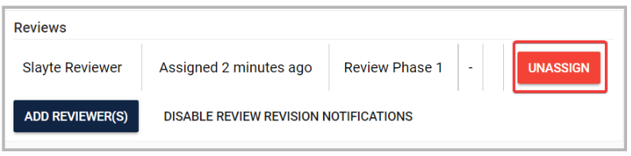
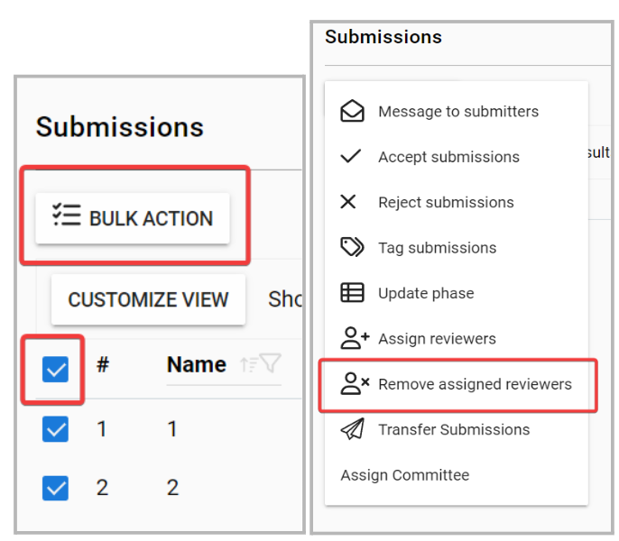
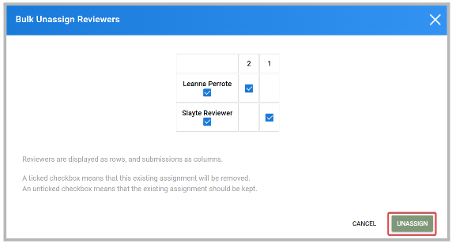

import React from 'react';
import { shareArticle } from '../../share.js';
import { FaLink } from 'react-icons/fa';
import { ToastContainer, toast } from 'react-toastify';
import 'react-toastify/dist/ReactToastify.css';

export const ClickableTitle = ({ children }) => (
    <h1 style={{ display: 'flex', alignItems: 'center', cursor: 'pointer' }} onClick={() => shareArticle()}>
        {children} 
        <FaLink size="0.6em" />
    </h1>
);

<ToastContainer />

<ClickableTitle>Remove Assigned Reviewers</ClickableTitle>

You can remove already assigned reviewers from your submissions, either individually or in bulk. 

* Individually: from the Submissions tab, locate the submission you would like to update and click View. In the “Reviews” section, to the right of the reviewer, you are looking to remove, click “Unassign”. 
* Bulk: From the submissions tab, select all submissions by marking the checkbox on the left top corner or select as many as submissions you want, click “Bulk action” and from the popup menu select “Remove assign reviewers” 

You can pre-view the reviewers and submissions previously selected, then click Unassign to complete the process. 

A ticked checkbox means that this existing assignment will be removed. An unticked checkbox means that the existing assignment should be kept.

