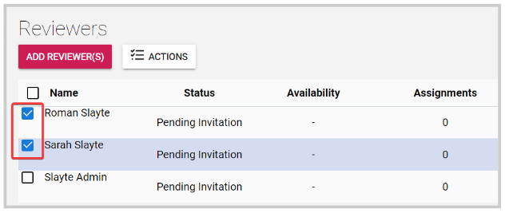
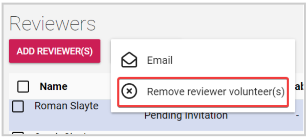
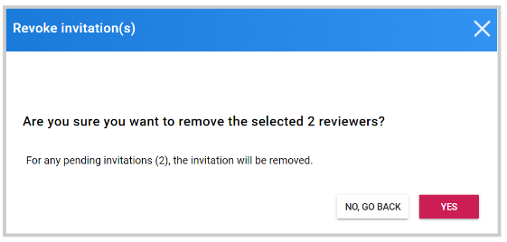

import { shareArticle } from '../../../components/share.js';
import { FaLink } from 'react-icons/fa';
import { ToastContainer, toast } from 'react-toastify';
import 'react-toastify/dist/ReactToastify.css';

export const ClickableTitle = ({ children }) => (
    <h1 style={{ display: 'flex', alignItems: 'center', cursor: 'pointer' }} onClick={() => shareArticle()}>
        {children} 
        <FaLink size="0.6em" />
    </h1>
);

<ToastContainer />

<ClickableTitle>Remove Reviewer Invite</ClickableTitle>

1. From the desired call, click the **Reviewers** tab from the top bar 

2. Select some or all reviewers by checking the checkbox to left 

3. Click the **Actions** button 

4. Select **Remove Reviewer Volunteer(s)**

****

5. Click Yes to complete the process 

**Note:** if the reviewer has already assigned reviews, he/she won't be able to review them anymore; and said reviews will need to be manually removed

