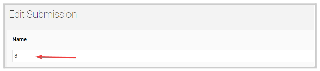
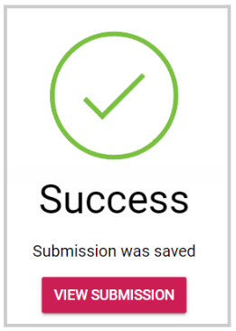
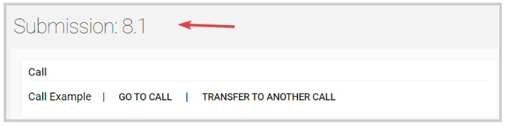

import React from 'react';
import { shareArticle } from '../../share.js';
import { FaLink } from 'react-icons/fa';
import { ToastContainer, toast } from 'react-toastify';
import 'react-toastify/dist/ReactToastify.css';

export const ClickableTitle = ({ children }) => (
    <h1 style={{ display: 'flex', alignItems: 'center', cursor: 'pointer' }} onClick={() => shareArticle()}>
        {children} 
        <FaLink size="0.6em" />
    </h1>
);

<ToastContainer />

<ClickableTitle>Rename a Submitter's Submission</ClickableTitle>

1. From the **Call** holding the submission, go to the **Submissions** Tab  
2. Locate the submission to update and click **View**   
3. Click **Revise/Edit**   
4. The submission name is the first field located on the top of the submission, type the new name to use here 

5. Click **Save**

6. You will receive the following confirmation

The change is effective immediately for all parties involved in the submission 

