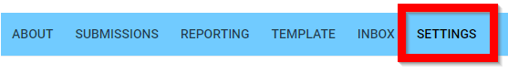
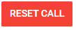
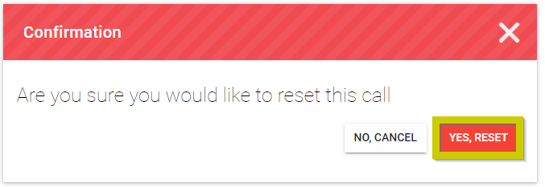
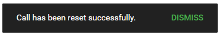

import React from 'react';
import { shareArticle } from '../../share.js';
import { FaLink } from 'react-icons/fa';
import { ToastContainer, toast } from 'react-toastify';
import 'react-toastify/dist/ReactToastify.css';

export const ClickableTitle = ({ children }) => (
    <h1 style={{ display: 'flex', alignItems: 'center', cursor: 'pointer' }} onClick={() => shareArticle()}>
        {children} 
        <FaLink size="0.6em" />
    </h1>
);

<ToastContainer />

<ClickableTitle>Reset a Call</ClickableTitle>

By resetting the call, you are removing/deleting all data already received at that point. All submissions and reviews are deleted, as well as any review assignment, and all messages received on the Call inbox are also deleted. Call general settings, submission and review configuration will remain the same. 

These are the steps to follow: 

1. Go to **Calls**, and select the desired call to reset  

2. Click **Settings** from the top bar

3. Scroll down, then click **Reset Call**

4. **Confirm** the request to reset the call by selecting **Yes, Reset**

5. **Dismiss** notification of Call has been reset successfully

