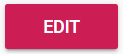
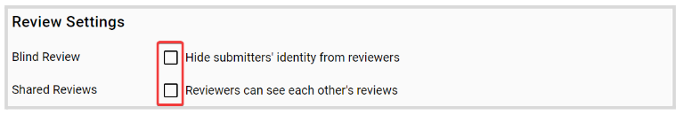
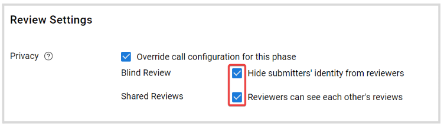
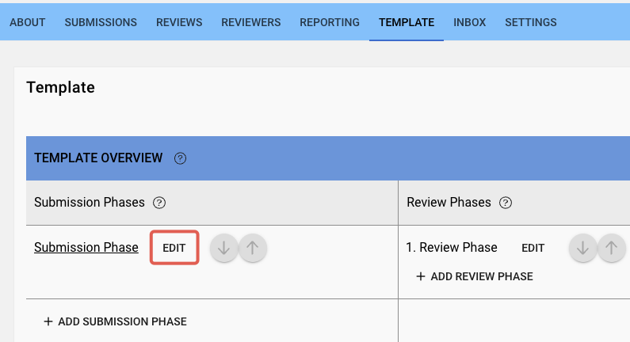
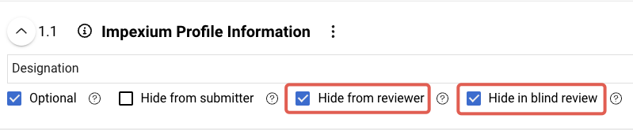

import React from 'react';
import { shareArticle } from '../../share.js';
import { FaLink } from 'react-icons/fa';
import { ToastContainer, toast } from 'react-toastify';
import 'react-toastify/dist/ReactToastify.css';

export const ClickableTitle = ({ children }) => (
    <h1 style={{ display: 'flex', alignItems: 'center', cursor: 'pointer' }} onClick={() => shareArticle()}>
        {children} 
        <FaLink size="0.6em" />
    </h1>
);

<ToastContainer />

<ClickableTitle>Review Privacy Settings</ClickableTitle>

Oftentimes, to avoid bias, identity or certain information about the submitter should not be revealed to reviewers. You can enable/disable the following criteria on **Call** or **Review Phase** basis: 

* **Blind Review:** reviewers cannot see the author of a submission. Submission authors cannot see their assigned reviewers. Reviewers can see other reviews.
* **Shared Reviews:** Reviewers can/ cannot see each other's reviews. The submitter can view the reviewer's review on their submission as long as the review phase is active.

## **Call Configuration**

1. From the desired call, click the **Settings** tab from the top bar

2. Click **Edit**

****

3. Scroll down to **Review Settings,** and click the checkbox to enable the option that applies 

4. Click **Save** 

## **Review Phase Configuration**

1. From the desired call, click the **Template** tab from the top bar

2. Click **Edit** next to the review phase to update 

3. Locate the **Review Settings** section, and click the checkbox for **Override call configuration for this phase**to apply a specific configuration to the selected phase. 

4. Select the desired criteria 

5. Click **Save**

 

## **Assigning Fields for Blind Review**

Within the submission form, each field can be designated visibility properties, these include the fields that should be hidden for blind review.

To assign a field, blind review/hidden from reviewer properties, you can follow these steps:

1. From the desired call, under submission phase, select the submission phase in question.
2. Under the Submission Form, click “Edit” or “View Live Form” (and then edit at the bottom).
3. Click the “Hide in blind review” checkbox under the field.
4. Save the configuration settings.

Hide from reviewer has a similar effect to hide from blind review, and the fields will also be hidden permanently from reviewer, without the requirement of the toggle.

