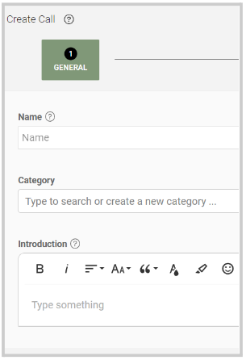
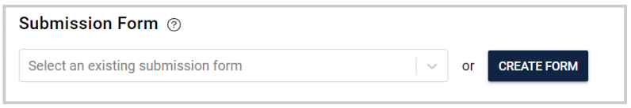
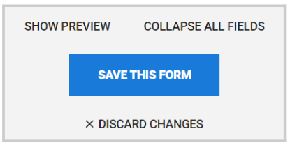
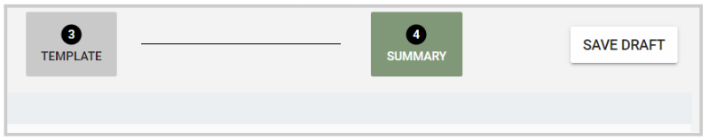

import { shareArticle } from '../../../components/share.js';
import { FaLink } from 'react-icons/fa';
import { ToastContainer, toast } from 'react-toastify';
import 'react-toastify/dist/ReactToastify.css';

export const ClickableTitle = ({ children }) => (
    <h1 style={{ display: 'flex', alignItems: 'center', cursor: 'pointer' }} onClick={() => shareArticle()}>
        {children} 
        <FaLink size="0.6em" />
    </h1>
);

<ToastContainer />

<ClickableTitle>Save a Call Draft</ClickableTitle>

While creating a Call, you can create a Draft with the progress to continue with the setup at a later time.

To successfully save a draft, you are required to include at least in the “General” section (Name, description):

Next, in the "Template" section, click "Add a Submission phase" then "Edit" for additional set up. From there under "Submission Form" you can start creating the form by clicking the "Create Form" button. 

Make sure to save the form progress by clicking the Save this Form button at the bottom of the page. 

Once the above is complete, on the right top corner, you can click the Save Draft button: 

To continue with the set-up, from the main menu, go to Calls and locate the desire Call under the “Draft Call section”. 

 

 

