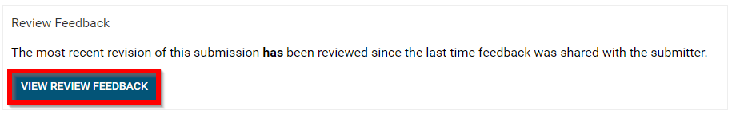
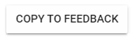

import React from 'react';
import { shareArticle } from '../../share.js';
import { FaLink } from 'react-icons/fa';
import { ToastContainer, toast } from 'react-toastify';
import 'react-toastify/dist/ReactToastify.css';

export const ClickableTitle = ({ children }) => (
    <h1 style={{ display: 'flex', alignItems: 'center', cursor: 'pointer' }} onClick={() => shareArticle()}>
        {children} 
        <FaLink size="0.6em" />
    </h1>
);

<ToastContainer />

<ClickableTitle>Send Review Feedback</ClickableTitle>

1. Navigate to the **Call** holding the submission you would like to send review feedback or select from the **Submissions** tab

2. Click **View** on the Submission you would like to send review feedback

3. Scroll down to the Review Feedback section of the submission then select **VIEW REVIEW FEEDBACK**

4. Set the feedback to **Show only unshared reviews** or **Show** **all reviews** by selecting the bullet by the desired selection

5. As an administrator you will be able to copy feedback to the body of the email by selecting **COPY TO FEEDBACK** button

6. Ensure to compose the body of the email

7. Select the bullet **Action**on sending the email and changing the status of the submission

* **Send Only** - Changes the status of the submission to Open
* **Accept & Send** - Changes the status of the submission to Accept
* **Allow Revision & Send** - Changes the status of the submission to Make Editable
* **Reject & Send** - Changes the status of the submission to Rejected

8. As you change the action please take note on the button changing then **click it** when ready to send email and change the status of the submission

/*Please note, you will be BCC'd on the email sent to the submitter.

/*/*Please note, you can always change the status of a submission at any given time.

 

 

 

 

