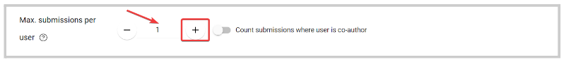

import { shareArticle } from '../../../components/share.js';
import { FaLink } from 'react-icons/fa';
import { ToastContainer, toast } from 'react-toastify';
import 'react-toastify/dist/ReactToastify.css';

export const ClickableTitle = ({ children }) => (
    <h1 style={{ display: 'flex', alignItems: 'center', cursor: 'pointer' }} onClick={() => shareArticle()}>
        {children} 
        <FaLink size="0.6em" />
    </h1>
);

<ToastContainer />

<ClickableTitle>Set a Submission Count Limit</ClickableTitle>

Whether you would like to increase or reduce the number of submissions allow per submitter, you can set an exact amount or a maximum number of submissions for each submitter, per submission phase basis. 

1. Go to Calls, and select the desired Call tile 

2. Click Template from the top bar 

3. On the Submission Settings section, locate the **Max. submissions per user** field. Please note, by default the submission phase is set to 1 submission only. Change the number by **clicking** the **minus** or **plus** sign button or **typing** **the number**directly in the field

4. (Optional) You can enable **Count Submissions Where User Is Co-Author.** This way, any submission where the submitter was added or assigned as Co-Author will count towards the maximum number of submissions in addition to submissions directly created by said submitter. 

5. Click **Save** in the right top corner. 

