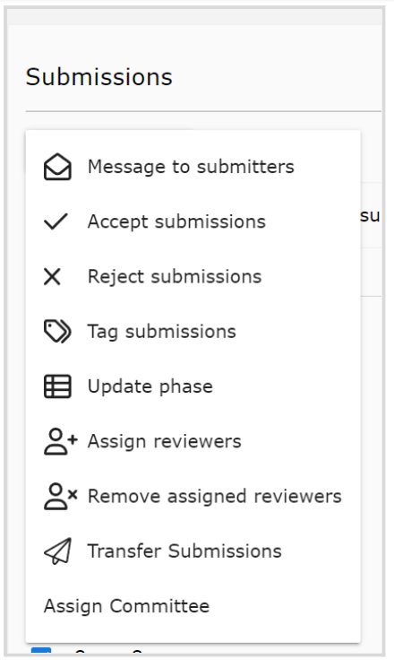
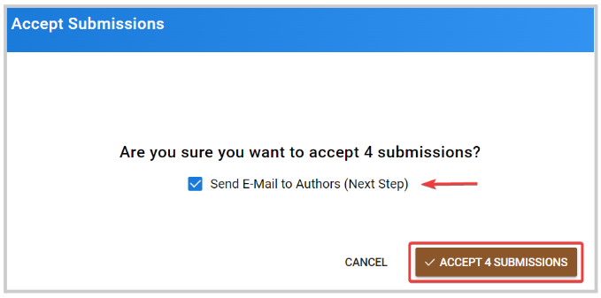
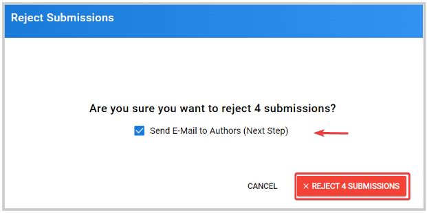
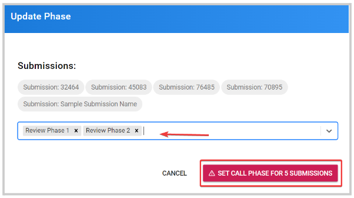
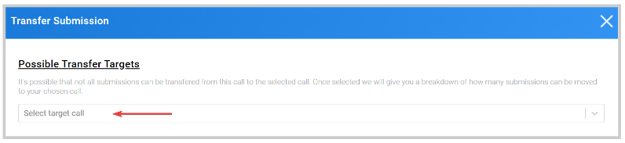
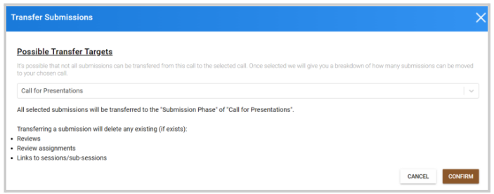

import { shareArticle } from '../../../components/share.js';
import { FaLink } from 'react-icons/fa';
import { ToastContainer, toast } from 'react-toastify';
import 'react-toastify/dist/ReactToastify.css';

export const ClickableTitle = ({ children }) => (
    <h1 style={{ display: 'flex', alignItems: 'center', cursor: 'pointer' }} onClick={() => shareArticle()}>
        {children} 
        <FaLink size="0.6em" />
    </h1>
);

<ToastContainer />

<ClickableTitle>Submissions Bulk Actions</ClickableTitle>

When managing submissions, you have available several functions that can be performed in bulk to minimize time and effort.

From the **Submissions** tab, you can select some or all submissions to work with. Once selected, the **Bulk Action** button will be enabled. Find the following available functions:

## Message to Submitters

You can send a message to submitters/authors of selected or all submissions to communicate any updates, next steps, etc. Find the steps to follow [here](https://docs-for-customers.slayte.com/hc/en-us/articles/4416092806547-Bulk-Email-Submitter-s-)

## Accept Submissions

Accept some or all submissions at once. Optional: you can check or uncheck to email the authors of the selected submissions about the acceptance. 

## Reject Submissions

Reject some or all submissions at once. Optional: you can check or uncheck to email the authors of the selected submissions about the rejection. 

## Tag Submissions

You can modify/add or create new tags to assign to all selected submissions. Find the steps to follow [here](https://docs-for-customers.slayte.com/hc/en-us/articles/115010025288-Create-Tag-s-)

## Update Phase

Modify or assign a review phase to some or all submissions, you can assign more than one phase at a time.

## Assigned Reviewers

You can assign a single or multiple reviewers/ reviewers group for all selected submissions at once. Find the steps for Bulk Assignment [here](https://docs-for-customers.slayte.com/hc/en-us/articles/4413315125395)

## Remove Assigned Reviewers

You can remove a single or multiple reviewers/ reviewers group for all selected submissions at once. Find the steps on how to Remove Assigned Reviewers in Bulk [here](https://docs-for-customers.slayte.com/hc/en-us/articles/8974386435603-Remove-Assigned-Reviewers)

## Transfer Submissions

Move from one Call to another, some or all eligible submissions. You will be required to **Select Target Call** that will be able to host the submissions

You'll receive a confirmation if all selected submissions can be transfer. Also note, transferring a submission will delete the following criteria (if exists): reviews, review assignments and links to sessions/sub-sessions

Find the steps on how to accept a transferred submission [here](https://docs-for-customers.slayte.com/hc/en-us/articles/4413760433811-Accept-Reject-Transferred-Submission-s-)

