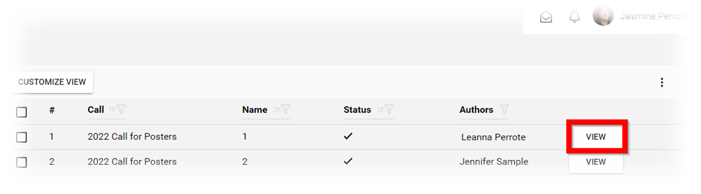
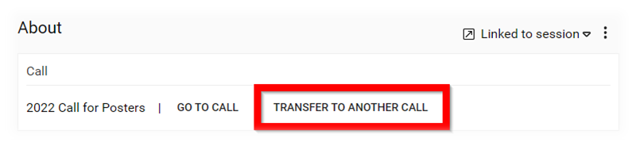
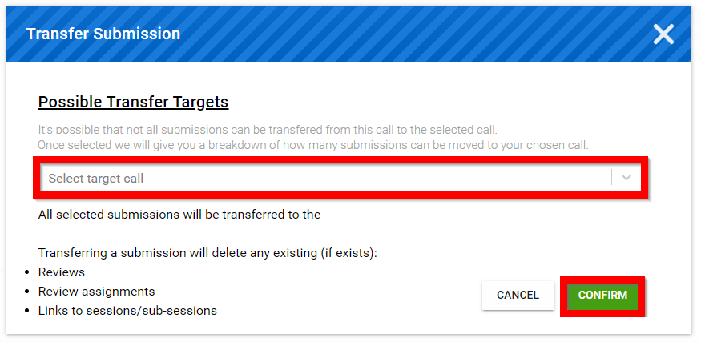

import React from 'react';
import { shareArticle } from '../../share.js';
import { FaLink } from 'react-icons/fa';
import { ToastContainer, toast } from 'react-toastify';
import 'react-toastify/dist/ReactToastify.css';

export const ClickableTitle = ({ children }) => (
    <h1 style={{ display: 'flex', alignItems: 'center', cursor: 'pointer' }} onClick={() => shareArticle()}>
        {children} 
        <FaLink size="0.6em" />
    </h1>
);

<ToastContainer />

<ClickableTitle>Transfer a Single Submission</ClickableTitle>

1. Navigate to the **Call** holding the submission you would like to ***transfer*** or select from the **Submissions** tab

2. Click **View** on the submission you would like to transfer

3. From the submission select **TRANSFER TO ANOTHER CALL**

4. **Click/Tap** inside the "Select target call" field to select desired call to transfer submission to then select CONFIRM

Please note, in order to allow transferring of submissions from one call to another you will need to copy a call then select **Link, not copy, the submission/review forms** (please ensure submission deadline date is current). Another take away from this article is that the submission form from both calls match entirely to transfer submissions./*

Please note, anyone previously assigned or completed reviews will not move with the transferred submission from one call to another. /*/*

