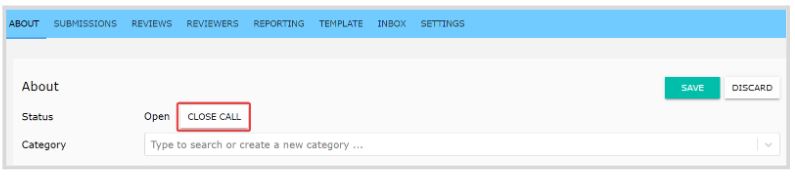
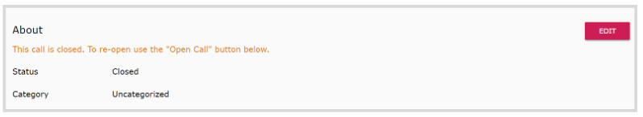
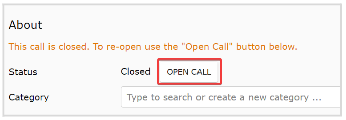

import { shareArticle } from '../../../components/share.js';
import { FaLink } from 'react-icons/fa';
import { ToastContainer, toast } from 'react-toastify';
import 'react-toastify/dist/ReactToastify.css';

export const ClickableTitle = ({ children }) => (
    <h1 style={{ display: 'flex', alignItems: 'center', cursor: 'pointer' }} onClick={() => shareArticle()}>
        {children} 
        <FaLink size="0.6em" />
    </h1>
);

<ToastContainer />

<ClickableTitle>Update Call Status</ClickableTitle>

As an Administrator, you can update the call status as needed or required, which will determine the level of access to all people involved.

## **Open**

When creating a Call, this is set to Open by default. In this state, the Call is open for Administrators to manage yet not available for submitters or reviewers. While open, you can set the call:

* **Public:** call is visible to unregistered users
* **Released:** release the call to make it visible to submitters and reviewers. Keep in mind, even if the call is released; you're still required to enable the submission or review phase by setting up a start-end date to start receiving submissions/ reviews.

## **Closed**

Once the call has been used and is no longer needed, you can close it. This state will remove the Call tile from the main Calls menu for all submitters/reviewers. You can follow these steps: 

1. From the **About** tab, click **Edit**

2. Click **Close Call**

3. Click **Save**

4. The about section will be updated as follows

To **reopen**, click **Edit** again to enable the **Open Call** button and **Save** the changes

 

