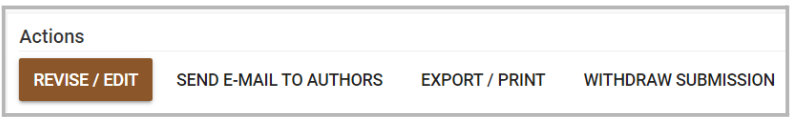
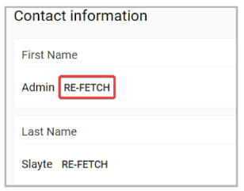
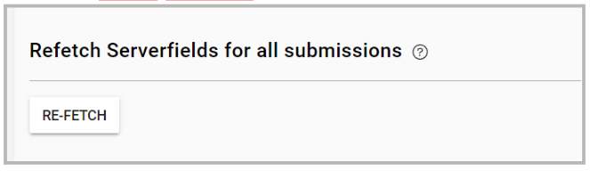

import { shareArticle } from '../../../components/share.js';
import { FaLink } from 'react-icons/fa';
import { ToastContainer, toast } from 'react-toastify';
import 'react-toastify/dist/ReactToastify.css';

export const ClickableTitle = ({ children }) => (
    <h1 style={{ display: 'flex', alignItems: 'center', cursor: 'pointer' }} onClick={() => shareArticle()}>
        {children} 
        <FaLink size="0.6em" />
    </h1>
);

<ToastContainer />

<ClickableTitle>Update Outdated Contact Information in a Submission</ClickableTitle>

The “Serverfield” type, has the ability to fetch profile information from the user’s Impexium Profile, and these can be automatically populated in a submission.

However, when a submitter updated any contact information on their Impexium Profile, these changes are not updated and applied to existing submissions. You can then manually update the submission with the most up-to-date information from Impexium. 

When updating a single submission, you can follow these steps: 

1. In the Submissions tab, locate the submission in question and click View
2. On the Actions section, click Revise/Edit

     3. Locate the contact information section and click “Re-Fetch” to the field you would like to update.

If you would like to update all existing submission's server fields; you can follow these steps: 

1. Within the Call in question, click the “Settings” tab.
2. Locate the “Refetch Serverfields for all submissions” section and click “Re-fetch”.

Note, clicking this button re-fetches all serverfields of all submissions in this call, and updates them to their new value. This change can't be undone.

