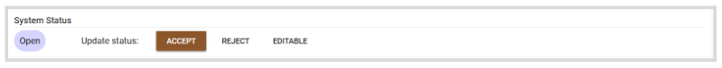
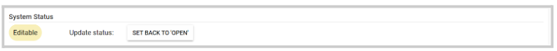

import { shareArticle } from '../../../components/share.js';
import { FaLink } from 'react-icons/fa';
import { ToastContainer, toast } from 'react-toastify';
import 'react-toastify/dist/ReactToastify.css';

export const ClickableTitle = ({ children }) => (
    <h1 style={{ display: 'flex', alignItems: 'center', cursor: 'pointer' }} onClick={() => shareArticle()}>
        {children} 
        <FaLink size="0.6em" />
    </h1>
);

<ToastContainer />

<ClickableTitle>Update a Single Submission Status</ClickableTitle>

As an Administrator, you can update the submission Status from within the submission details page.

1. Click **View** next to the submission you would like to update   
2. Locate the **System Status** section. Here you will find the following status:

* Accept: the submission will be automatically accepted. Optional, you can send them an email with the acceptance to the author/authors.
* Reject: the submission will be automatically rejected. Optional, you can send them an email with the rejection to the author/authors.
* Editable: allow the submitter a one-time edit.
* Set back to Open: if the submission was set to Editable and no edit has been made by the submitter; you can set it back to Open.

