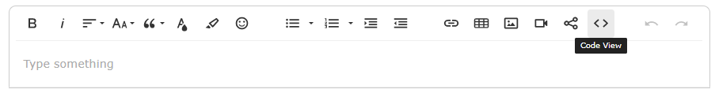
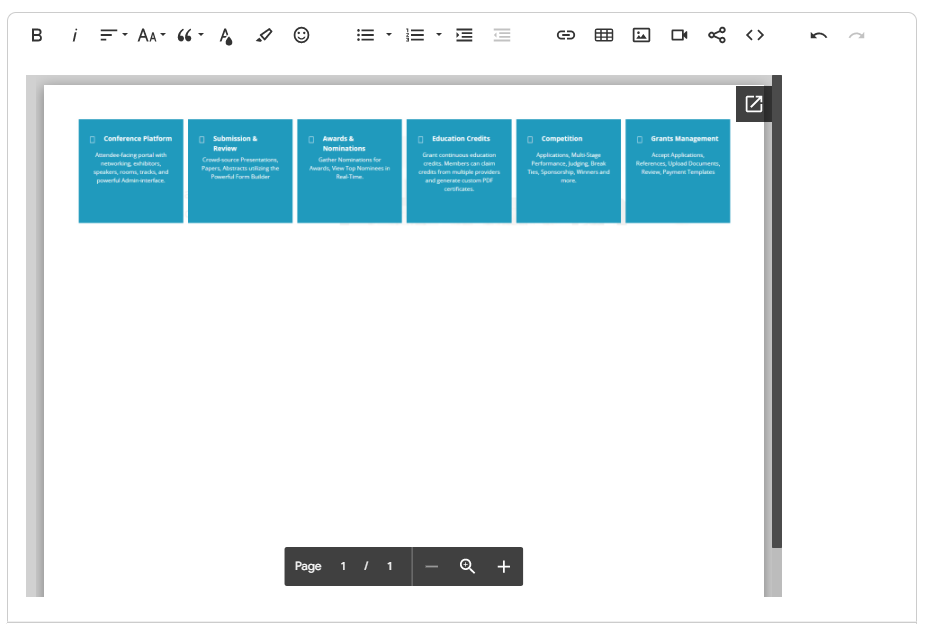

import React from 'react';
import { shareArticle } from '../../share.js';
import { FaLink } from 'react-icons/fa';
import { ToastContainer, toast } from 'react-toastify';
import 'react-toastify/dist/ReactToastify.css';

export const ClickableTitle = ({ children }) => (
    <h1 style={{ display: 'flex', alignItems: 'center', cursor: 'pointer' }} onClick={() => shareArticle()}>
        {children} 
        <FaLink size="0.6em" />
    </h1>
);

<ToastContainer />

<ClickableTitle>Use Static Text Field to Embed PDF Instructions</ClickableTitle>

Embedding PDF instructions in a document is often considered to be better than text instructions for several reasons:

1. **Visual appeal**: PDF instructions can include images, graphics, and other visual aids that make them more engaging and easier to understand.
2. **Formatting consistency**: PDF instructions retain their formatting, making them easier to read and understand, regardless of the device or software used to view them.
3. **Interactive elements**: PDF instructions can include interactive elements such as hyperlinks, buttons, and form fields that allow for more interactive and dynamic instructions.
4. **Portability**: PDF instructions can be easily shared and viewed on a variety of devices and platforms, making them more accessible to a wider range of users.
5. **Document security**: PDF instructions can be secured with password protection, digital signatures, and other security measures, ensuring that confidential information is protected.

In summary, embedding PDF instructions provide a visually appealing, consistent, interactive, portable, and secure format for delivering instructions and information.

 

1. Save the PDF for public viewing in your file destination

2. Navigate to Slayte select **ADD FIELD** then select **Static Text** form builder option

3. Click on **Code Review**

****

4. Paste the code

**
**  
**<iframe src="<PdfFileDestinationUrl>/preview" width="840" height="580"></iframe>**  
**
**

/*Ensure you have changed PdfFileDestinationUrl to the PDF URL

5. Click on **Code Review**

The link will automatically turn to an embedded PDF, please see the sample below.

