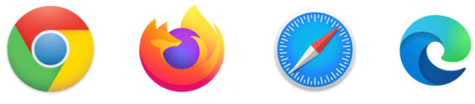

import { shareArticle } from '../../../components/share.js';
import { FaLink } from 'react-icons/fa';
import { ToastContainer, toast } from 'react-toastify';
import 'react-toastify/dist/ReactToastify.css';

export const ClickableTitle = ({ children }) => (
    <h1 style={{ display: 'flex', alignItems: 'center', cursor: 'pointer' }} onClick={() => shareArticle()}>
        {children} 
        <FaLink size="0.6em" />
    </h1>
);

<ToastContainer />

<ClickableTitle>What browser types are supported?</ClickableTitle>

Slayte is built to work in most common web browsers. Supported Web Browsers:

* Chrome (Latest version)
* Firefox (Latest version)
* Safari 10 and later
* Microsoft Edge 15 and later

For the best experience we recommend using **Google Chrome**.

 

