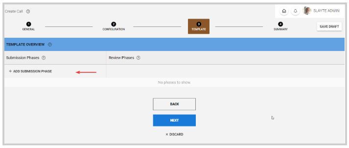
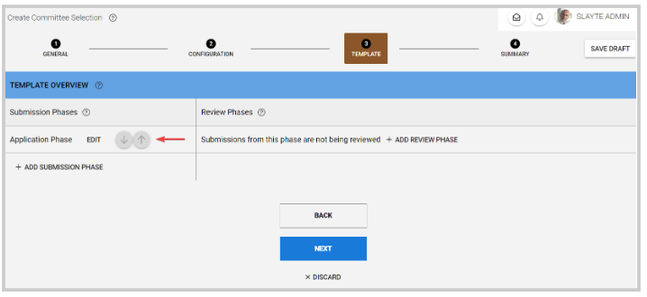
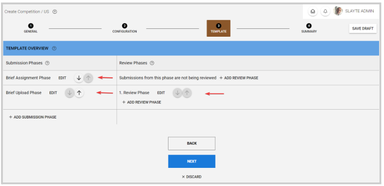

import { shareArticle } from '../../../components/share.js';
import { FaLink } from 'react-icons/fa';
import { ToastContainer, toast } from 'react-toastify';
import 'react-toastify/dist/ReactToastify.css';

export const ClickableTitle = ({ children }) => (
    <h1 style={{ display: 'flex', alignItems: 'center', cursor: 'pointer' }} onClick={() => shareArticle()}>
        {children} 
        <FaLink size="0.6em" />
    </h1>
);

<ToastContainer />

<ClickableTitle>Available Call Types</ClickableTitle>

You can create and personalize a Call depending on your use case. You can select from a few pre-defined options that will help you to make the call-creating process easier.

1. From the **Home** page, click the **Call tile** or click **Calls** from the left panel.   
2. Long press the **+ Create New Call** button, to display the Call options such as **Custom Call, Committee Selection, and Competition** (US, APAC, Europe, and LATAM), and click to start the creation process.   
/*/*Note: Competition type is available upon request.

The main difference between these call types is in step 3 Template, where depending on the call type; the submission and review phase is automatically set up. 

## **Custom Call**

This call type will not have any submission or review phase included, for you to add from scratch as needed.

## **Committee Selection**

A submission phase (Application phase) is included as the first step in a selection process. You can still add another submission or review phase if needed, you can also rename the phase if applicable. 

## **Competition**

Here, two submission phases are included (Brief Assignment Phase and Brief Upload Phase) and a review phase for the second submission phase. Note, this setup is recommended but not required, you can rename, remove or add phases as desired. 

3. Once you have updated the call settings and details, complete the call-creating process on **step 4 Summary**, by clicking **Create Call** at the bottom of the page.

