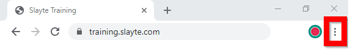
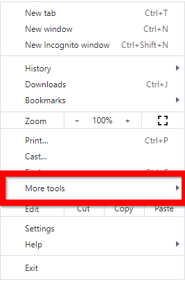
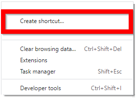
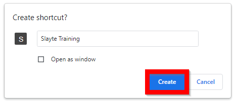

import React from 'react';
import { shareArticle } from '../../share.js';
import { FaLink } from 'react-icons/fa';
import { ToastContainer, toast } from 'react-toastify';
import 'react-toastify/dist/ReactToastify.css';

export const ClickableTitle = ({ children }) => (
    <h1 style={{ display: 'flex', alignItems: 'center', cursor: 'pointer' }} onClick={() => shareArticle()}>
        {children} 
        <FaLink size="0.6em" />
    </h1>
);

<ToastContainer />

<ClickableTitle>Create a Slayte Shortcut</ClickableTitle>

1. Type in *your* Slayte platform in the **URL**

2. Select the **ellipses**

3. Select **More tools**

4. Select **Create shortcut...**

5. Select **Create**

6. Your **shortcut** will now be on your desktop

7. To access, simply **double click** on your slayte icon

