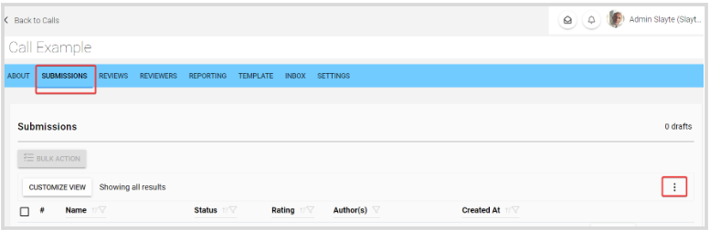
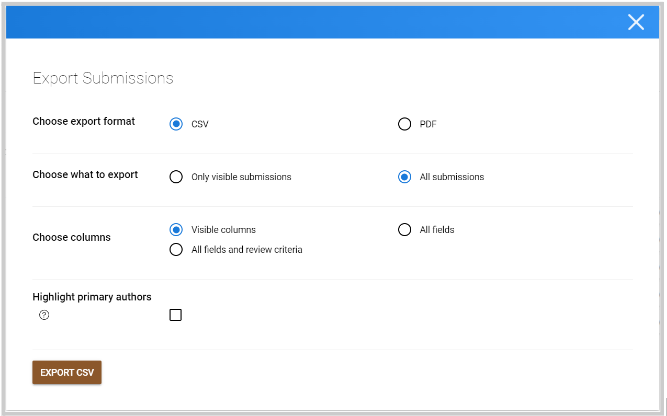
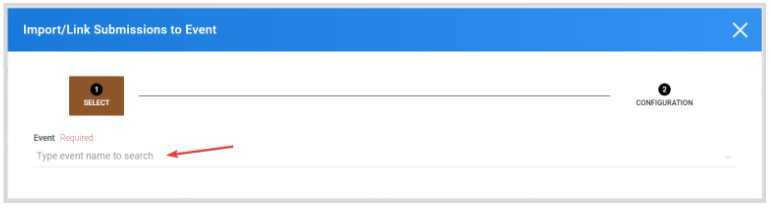
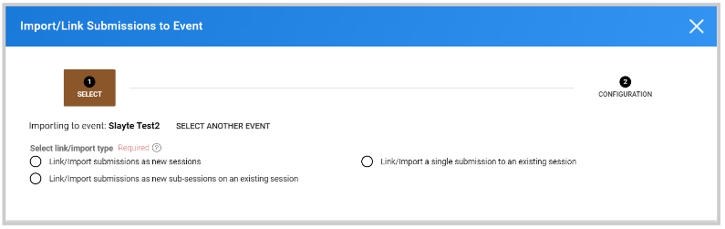
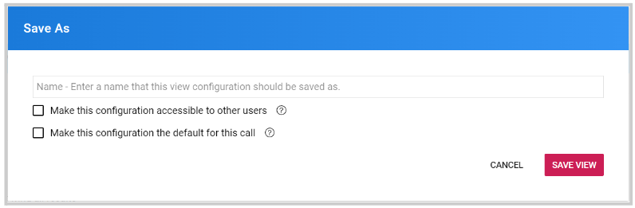
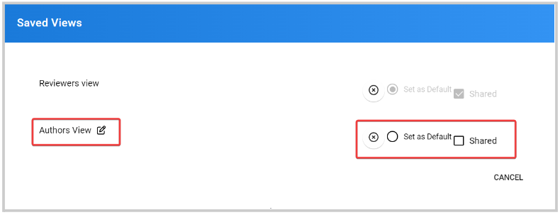
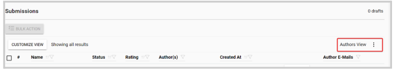
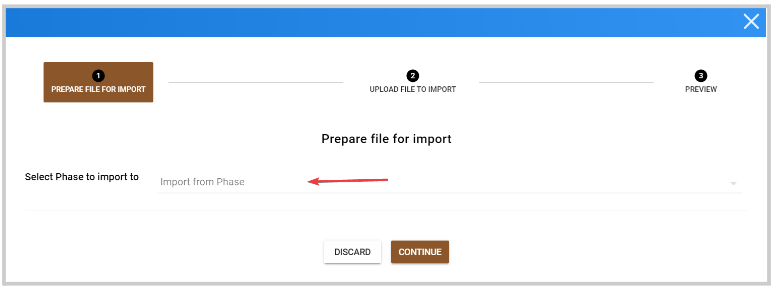
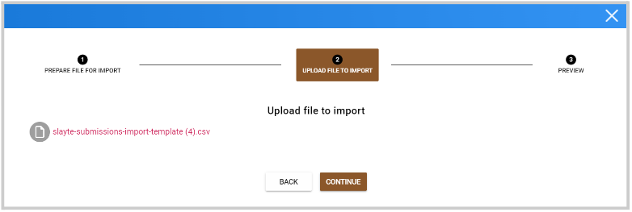
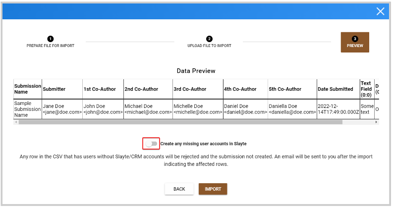

import React from 'react';
import { shareArticle } from '../../share.js';
import { FaLink } from 'react-icons/fa';
import { ToastContainer, toast } from 'react-toastify';
import 'react-toastify/dist/ReactToastify.css';

export const ClickableTitle = ({ children }) => (
    <h1 style={{ display: 'flex', alignItems: 'center', cursor: 'pointer' }} onClick={() => shareArticle()}>
        {children} 
        <FaLink size="0.6em" />
    </h1>
);

<ToastContainer />

<ClickableTitle>Submissions Tab Functions</ClickableTitle>

The submissions tab will list all submitted and draft submissions, as Administrator, you have several options to gather, export, manage and view all this data.

You can find all these options in the ellipsis button on the right top corner 

## **Export**

You can export selected or all submissions in a CSV / PDF file, or personalize the export criteria. For more information, visit [Export Submission(s)](https://docs-for-customers.slayte.com/hc/en-us/articles/115009676927-Export-Submission-s-)

### **Export/Link submissions to Event**

All data received via submissions can be connected to your event, to create sessions/ sub-sessions or update existing sessions.

1. Search and select the event name you want to link submissions to.

2. Select the action to take to whether you want to link submissions as new or to existing sessions or as sub-sessions of existing sessions. 

/*Note: You can also accomplish this directly from the Event settings, for more information visit [Import Submission(s) as Session(s)](https://docs-for-customers.slayte.com/hc/en-us/articles/4936850877331-Import-Submission-s-as-Session-s-) or [Link submissions as sub-sessions on an event session](https://docs-for-customers.slayte.com/hc/en-us/articles/10726980817683-Link-submissions-as-sub-sessions-on-an-event-session)

### **Refresh**

Refresh the current page you are in 

### **Customize View**

This will allow you to customize your submissions view, by adding/removing fields, arranging fields order for easier access, etc. For more information, visit [Create a Query / Customize Your Interactive Spreadsheet](https://docs-for-customers.slayte.com/hc/en-us/articles/4411227121811-Create-a-Query-Customize-Your-Interactive-Spreadsheet)

### **Save View / Save View As**

After you have customized a view, you can save it to use in the future. You'll also have the ability to share the view and make it accessible to everybody to use or set it as the default view to the call.

### **Load View**

You can easily select from any previously saved view by clicking in the view name, to load a view that will automatically display the selected fields for that view. From here, you can also set that view as **Default**or if you would like to **Share** the view. 

You can confirm the specific view you are in here

### **Import Submissions via CVS**

You can import submissions stored locally, or submissions exported from another call, using a .CSV file. Initially, you need to select the **phase** you would like to import to 

Click to select a file from your computer, or drag a file with submissions you would like to import to the call. Click **Continue** 

Once successfully uploaded, it will show a data preview. If desired, you can toggle ON to "Create any missing accounts in Slayte" to automatically create new names/email addresses as Slayte users.

