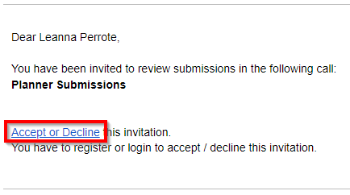
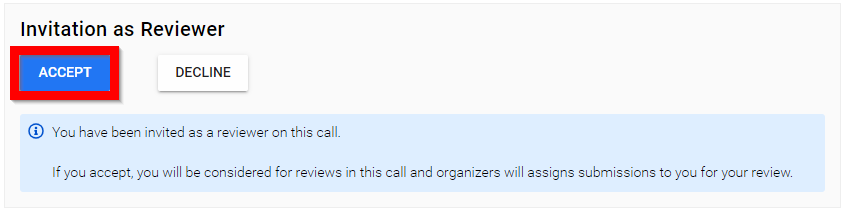
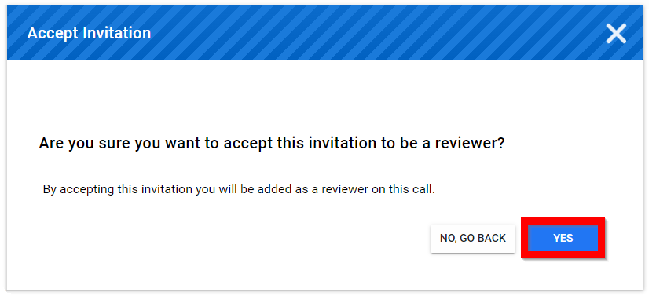

import React from 'react';
import { shareArticle } from '../../share.js';
import { FaLink } from 'react-icons/fa';
import { ToastContainer, toast } from 'react-toastify';
import 'react-toastify/dist/ReactToastify.css';

export const ClickableTitle = ({ children }) => (
    <h1 style={{ display: 'flex', alignItems: 'center', cursor: 'pointer' }} onClick={() => shareArticle()}>
        {children} 
        <FaLink size="0.6em" />
    </h1>
);

<ToastContainer />

<ClickableTitle>Accept / Decline Invitation to Review</ClickableTitle>

1. **Open your email** and select the **Accept or Decline hyperlink**

2. If not logged in, you will need to **log in**

3. Scroll down to select **ACCEPT** or **DECLINE**

4. Select **YES** to confirm acceptance of review invitation

