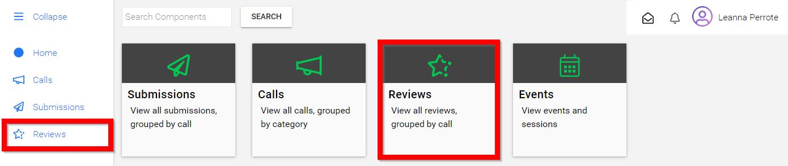
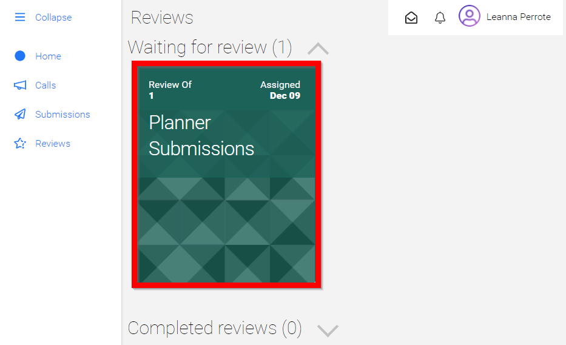
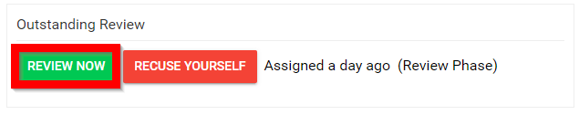
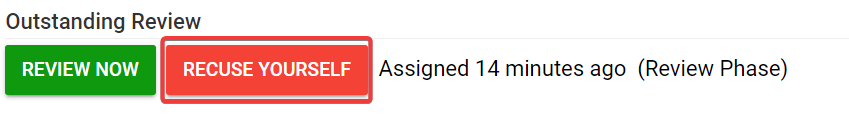
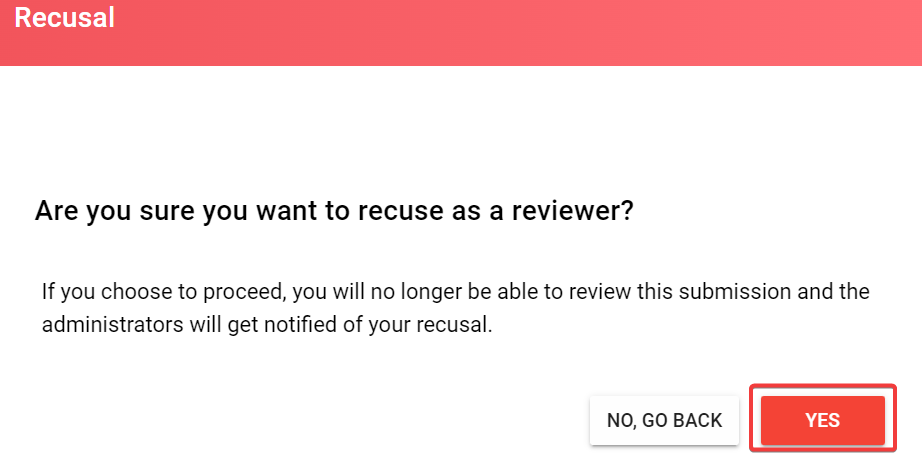

import { shareArticle } from '../../../components/share.js';
import { FaLink } from 'react-icons/fa';
import { ToastContainer, toast } from 'react-toastify';
import 'react-toastify/dist/ReactToastify.css';

export const ClickableTitle = ({ children }) => (
    <h1 style={{ display: 'flex', alignItems: 'center', cursor: 'pointer' }} onClick={() => shareArticle()}>
        {children} 
        <FaLink size="0.6em" />
    </h1>
);

<ToastContainer />

<ClickableTitle>Accept / Recuse Review</ClickableTitle>

1. From the Home screen select **Reviews** from the left pane or tile

2. Navigate to the **Waiting for review (#)** section [please note, the number will automatically change as submissions are assigned to the reviewer] then select the desired call. If there are multiple submissions within the call it will be presented to the reviewer.

3. Once in the submission the reviewer will have two options **REVIEW NOW** or **RECUSE YOURSELF**

4. If selected **REVIEW NOW,** the reviewer is presented with the completed submission and the review criteria

5. Once the review has been completed, select **SUBMIT REVIEW**

If instead, you don't want to review the submission; click **RECUSE YOURSELF**

From the pop- up window, click **YES** to continue 

**Note:** You will no longer be able to review this submission, and the administrators will get notified of your recusal.

