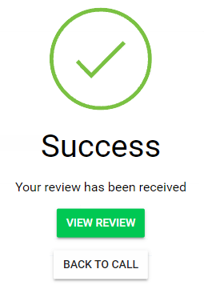

import React from 'react';
import { shareArticle } from '../../share.js';
import { FaLink } from 'react-icons/fa';
import { ToastContainer, toast } from 'react-toastify';
import 'react-toastify/dist/ReactToastify.css';

export const ClickableTitle = ({ children }) => (
    <h1 style={{ display: 'flex', alignItems: 'center', cursor: 'pointer' }} onClick={() => shareArticle()}>
        {children} 
        <FaLink size="0.6em" />
    </h1>
);

<ToastContainer />

<ClickableTitle>Edit Review(s) Based on Revised Submission</ClickableTitle>

1. From the Home screen select **Reviews**

2. Click **Completed reviews**and click the submission tile to review.

3. On the Reviewed section, an update notification will display 

And on top of the original review

4. Click **Revise/ Edit**, make modifications as necessary and Click **Submit Review**

5. **Congratulations** the modified review is completed

