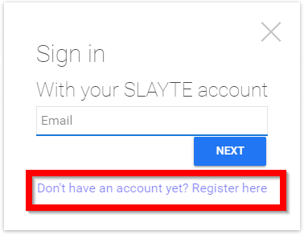
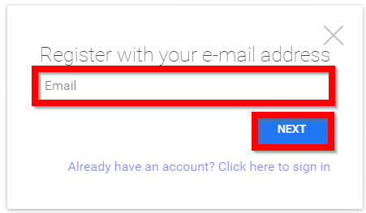
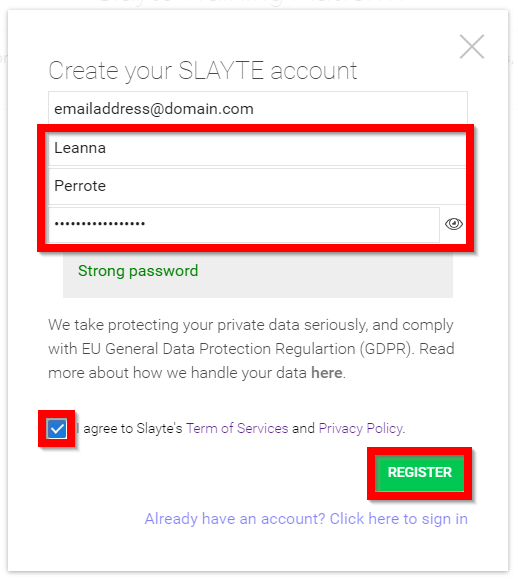
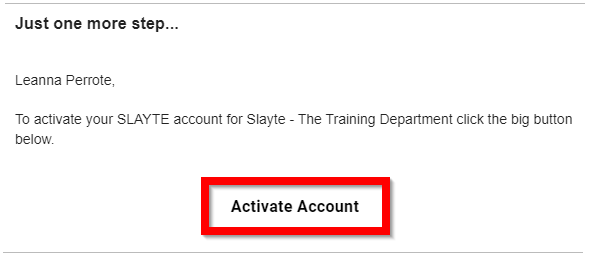
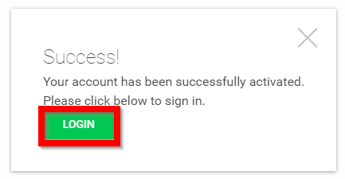

import { shareArticle } from '../../../components/share.js';
import { FaLink } from 'react-icons/fa';
import { ToastContainer, toast } from 'react-toastify';
import 'react-toastify/dist/ReactToastify.css';

export const ClickableTitle = ({ children }) => (
    <h1 style={{ display: 'flex', alignItems: 'center', cursor: 'pointer' }} onClick={() => shareArticle()}>
        {children} 
        <FaLink size="0.6em" />
    </h1>
);

<ToastContainer />

<ClickableTitle>Register</ClickableTitle>

1. From the provided URL select **REGISTER/LOG IN** from the left corner of the page

2. Click on **Don't have an account yet? Register here**

3. Type in your **email address** then select **NEXT**

****

4. **Complete** the following

* Enter in your First name
* Enter in your Last name
* Enter in a strong [password](https://docs-for-customers.slayte.com/hc/en-us/articles/4412307342995)
* Agree to Slayte's [Term of Services](https://docs-for-customers.slayte.com/hc/en-us/articles/4412307415699) and [Privacy Policy](https://docs-for-customers.slayte.com/hc/en-us/articles/4412295970579-Is-my-information-safe-in-Slayte-)
* Select Register when done

5. Go to your **email account** and select **Activate Account**

****

6. Select **Login**

****

