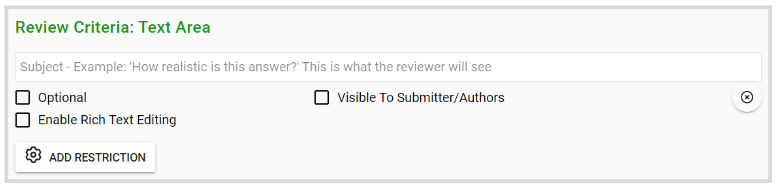
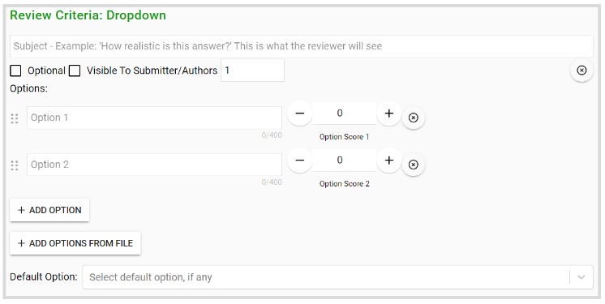
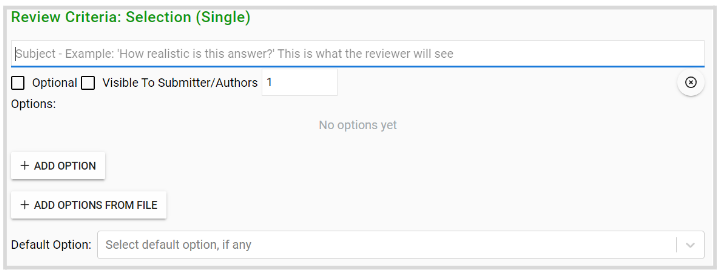
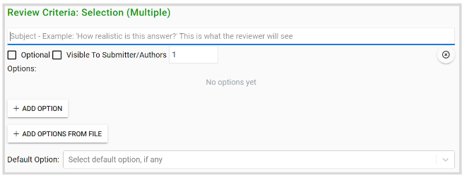
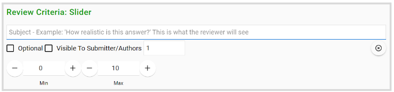
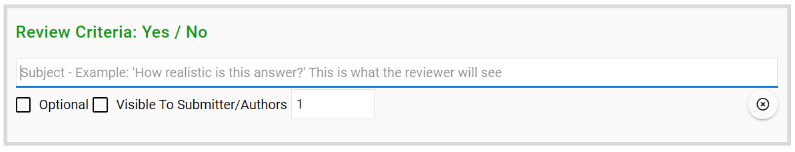
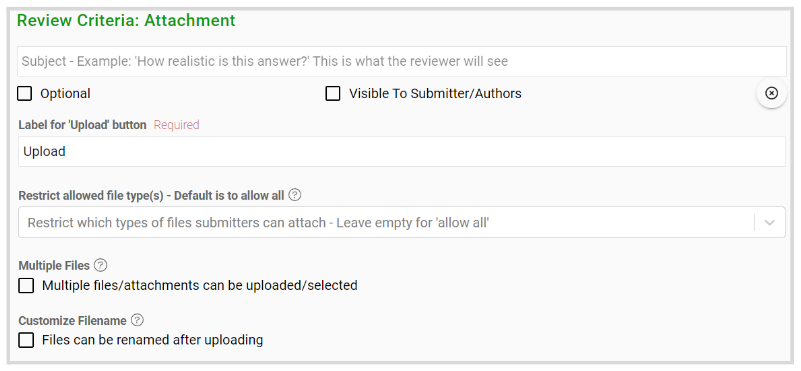
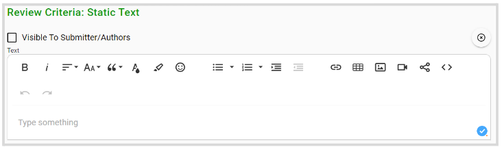
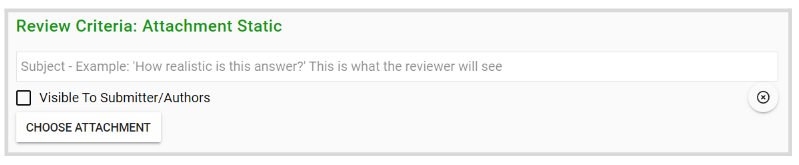

import { shareArticle } from '../../../components/share.js';
import { FaLink } from 'react-icons/fa';
import { ToastContainer, toast } from 'react-toastify';
import 'react-toastify/dist/ReactToastify.css';

export const ClickableTitle = ({ children }) => (
    <h1 style={{ display: 'flex', alignItems: 'center', cursor: 'pointer' }} onClick={() => shareArticle()}>
        {children} 
        <FaLink size="0.6em" />
    </h1>
);

<ToastContainer />

<ClickableTitle>Reviewer Fields Defined</ClickableTitle>

Find below the available Review From criteria used to rate Submissions. 

### Review Comment

A single line of text for the Reviewer to leave a comment about the field in question. You can enable Rich text or add a restriction (e.g. Max/Min # characters or words)

### Dropdown

Allow the Reviewer to select a single value from a list of provided options. You can add options in bulk with the **Add Options From a File**, and also set a **Default option** to be displayed if any. 

### Selection (Single)

Reviewers can select a single option, with all options being visibly listed above one another. Options can be added individually by clicking **Add Option,** or in bulk by clicking **Add Options From File**.

### Selection (Multiple)

Allow reviewers to select more than one option from a list, with all options being visibly listed above one another. Options can be added individually by clicking **Add Option,** or in bulk by clicking **Add Options From File**.

### Slider

Slider criteria allow you to create a sliding scale to provide a rating on a Submission, based on a range you define (from Min to Max)

### Yes/No

This will provide the Reviewers with the specific options of Yes or No

### Attachment

Allow Reviewers to upload documents as attachments. You can label this field with a specific display name, restrict the allowed file types, the number of files to upload, and customize the filename. 

## **Static elements**

### Static Text

Display static text, e.g. instructions

### Static Attachment

Allows you to upload a file that will remain fixed to this area

