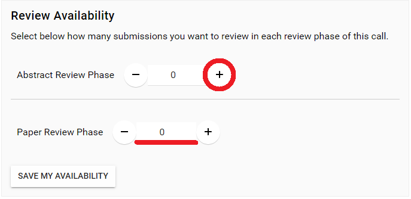
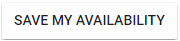
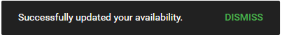

import React from 'react';
import { shareArticle } from '../../share.js';
import { FaLink } from 'react-icons/fa';
import { ToastContainer, toast } from 'react-toastify';
import 'react-toastify/dist/ReactToastify.css';

export const ClickableTitle = ({ children }) => (
    <h1 style={{ display: 'flex', alignItems: 'center', cursor: 'pointer' }} onClick={() => shareArticle()}>
        {children} 
        <FaLink size="0.6em" />
    </h1>
);

<ToastContainer />

<ClickableTitle>Set Review Availability</ClickableTitle>

When you have been invited to be a Reviewer on a Call, once you have accepted the invite, you can specify your availability to be considered while in the assignment process.

1. From the **Calls** menu, locate the call to update and click the **Call tile.**

2. Below the ***About*** section, locate the **Review Availability** section

3. Select Phase availability either by clicking **plus/minus** (-/+) or manually **typing** the numeric option in field

3. Select **SAVE MY AVAILABILITY** 

4. Your entry will be **saved**

If desired, you can increase or decrease the availability at any time after saving. The change will be received immediately on the Administrator side to be considered for the review assignment. 

 

/*Please note, if you have not been given the option to set your review availability, this was not configured by your system administrator. 

