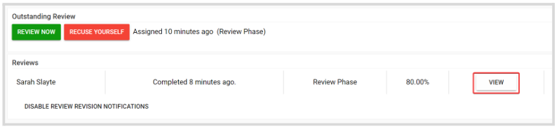

import { shareArticle } from '../../../components/share.js';
import { FaLink } from 'react-icons/fa';
import { ToastContainer, toast } from 'react-toastify';
import 'react-toastify/dist/ReactToastify.css';

export const ClickableTitle = ({ children }) => (
    <h1 style={{ display: 'flex', alignItems: 'center', cursor: 'pointer' }} onClick={() => shareArticle()}>
        {children} 
        <FaLink size="0.6em" />
    </h1>
);

<ToastContainer />

<ClickableTitle>View a Shared Review</ClickableTitle>

When enabled by the Administrator, you can view other Reviewer's reviews already made on a submission you've been assigned to review. 

1. From the Home page, go to **Reviews** and click the Call tile holding the Review  
2. A **Reviews** section will be enabled, listing all received reviews from other Reviewers. Click **View** to access the Review details. 

From here you will be able to see details such as: when the review took place, the rating, Review's name, and the review results  

