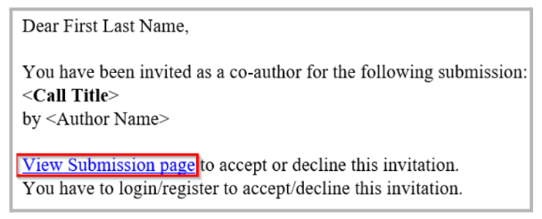
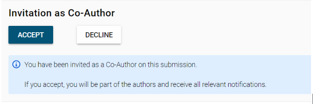
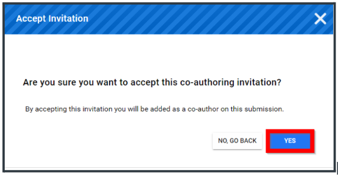

import React from 'react';
import { shareArticle } from '../../share.js';
import { FaLink } from 'react-icons/fa';
import { ToastContainer, toast } from 'react-toastify';
import 'react-toastify/dist/ReactToastify.css';

export const ClickableTitle = ({ children }) => (
    <h1 style={{ display: 'flex', alignItems: 'center', cursor: 'pointer' }} onClick={() => shareArticle()}>
        {children} 
        <FaLink size="0.6em" />
    </h1>
);

<ToastContainer />

<ClickableTitle>Accept / Decline Co-Author invite</ClickableTitle>

Within a Submission, a submitter or primary author is able to invite Co authors to be part  of the submission. An automated notification is generated to be sent to the selected contact email address, which will include the submission URL  in question. Example below:

To Accept/ Decline, sign in to the submission URL, and you’ll be prompted with a confirmation message: 

Click Accept / Declined, and click Yes to Save

 

 

 

 

 

 

