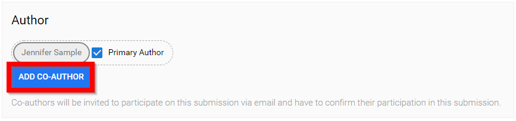
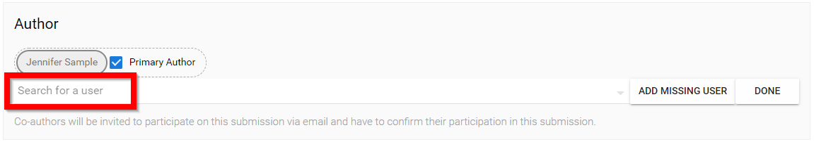
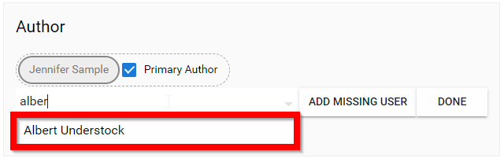
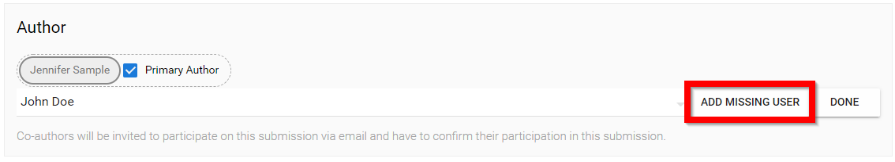
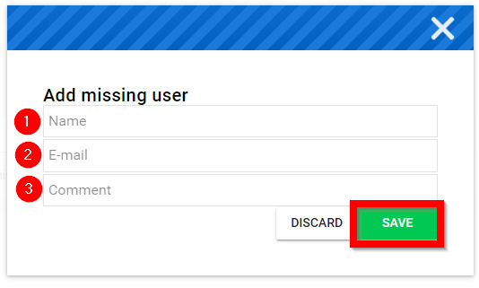
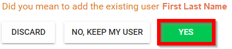
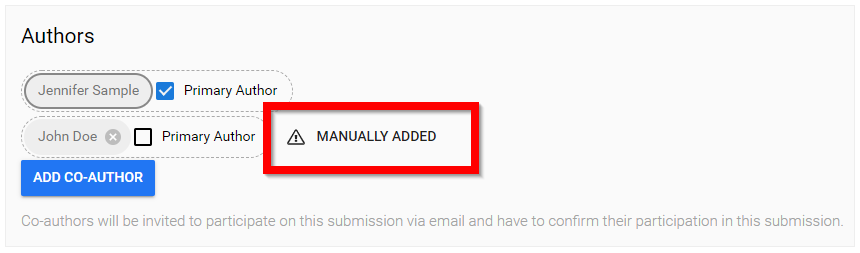

import React from 'react';
import { shareArticle } from '../../share.js';
import { FaLink } from 'react-icons/fa';
import { ToastContainer, toast } from 'react-toastify';
import 'react-toastify/dist/ReactToastify.css';

export const ClickableTitle = ({ children }) => (
    <h1 style={{ display: 'flex', alignItems: 'center', cursor: 'pointer' }} onClick={() => shareArticle()}>
        {children} 
        <FaLink size="0.6em" />
    </h1>
);

<ToastContainer />

<ClickableTitle>Add Co-Author(s)</ClickableTitle>

Adding a Co-author to your Submission allows you to tag another user that may have contributed to your Submission. This can save you and the other author duplication work by completing one Submission on behalf of all author(s).

1. Select **ADD CO-AUTHOR**

2. Search for a user by **typing in their name or email address** *(must use at least three characters to search)* /*/*Please note, if you cannot search by email address, this was enabled by your Call Administrator.

3. *If the co-author exists*, their name will appear in a drop down menu to **select co-author's name**

4. *If the co-author does not exist*, select **ADD MISSING USER**

5. **Fill in** Name, Email Address and Comment/Reason for adding missing user then select **SAVE**

Please note, if you fill in the required fields and are able to locate the user select **Yes**.

If you were unable to locate the requested co-author you will be provided with the saved co-author information of **Manually Added**

**/*Note:** If you follow the steps below and cannot see the Add Co-author button, it is most likely that this feature has not been enabled by your Call Administrator. If this is the case please reach out to your Call Administrator directly.

