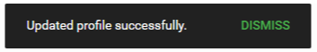

import React from 'react';
import { shareArticle } from '../../share.js';
import { FaLink } from 'react-icons/fa';
import { ToastContainer, toast } from 'react-toastify';
import 'react-toastify/dist/ReactToastify.css';

export const ClickableTitle = ({ children }) => (
    <h1 style={{ display: 'flex', alignItems: 'center', cursor: 'pointer' }} onClick={() => shareArticle()}>
        {children} 
        <FaLink size="0.6em" />
    </h1>
);

<ToastContainer />

<ClickableTitle>Additional Profile Information</ClickableTitle>

1. Select **your name** in the upper right corner

2. Select **Settings**

3. If permitted, **fill in** additional profile information 

Example: Biography

4. Select **Save** to complete

5. You will be notified **updated profile successfully**

