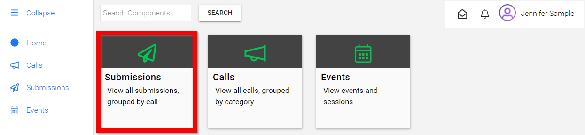
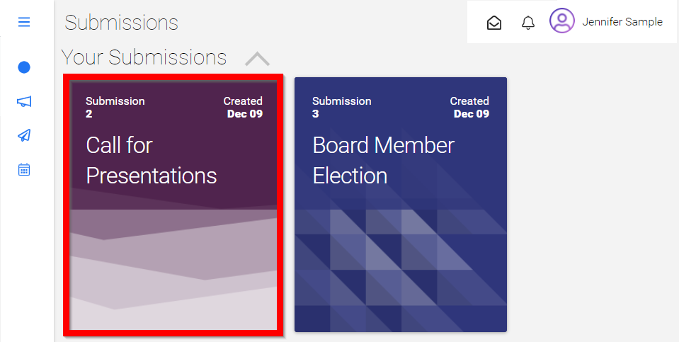
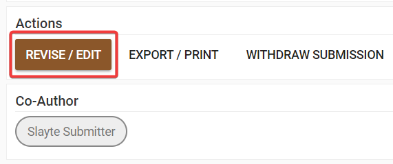
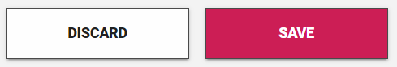

import React from 'react';
import { shareArticle } from '../../share.js';
import { FaLink } from 'react-icons/fa';
import { ToastContainer, toast } from 'react-toastify';
import 'react-toastify/dist/ReactToastify.css';

export const ClickableTitle = ({ children }) => (
    <h1 style={{ display: 'flex', alignItems: 'center', cursor: 'pointer' }} onClick={() => shareArticle()}>
        {children} 
        <FaLink size="0.6em" />
    </h1>
);

<ToastContainer />

<ClickableTitle>Edit a Submission</ClickableTitle>

1. From the home screen navigate to the **Submissions page**

2. Select the **desired submission**

3. From the Actions section, click Revise/Edit 

4. Select **Save** after making necessary changes

**/*Note:** The ability to make one round of changes to your Submission must be enabled by your Call Administrator. If you do not see the option to **Edit** your Submission contact your Call Administrator directly.

