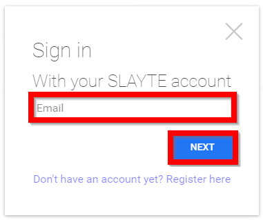
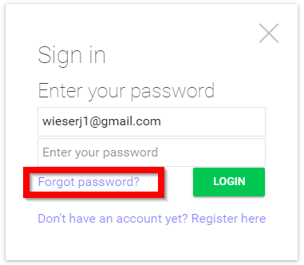
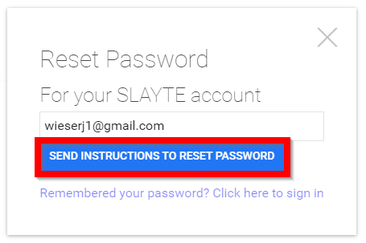
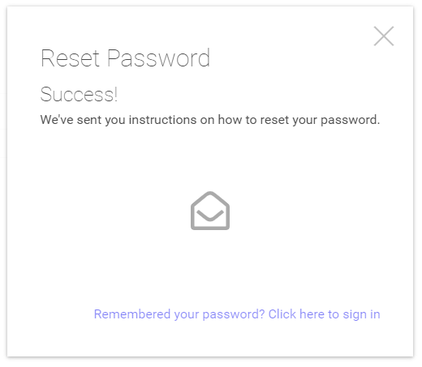
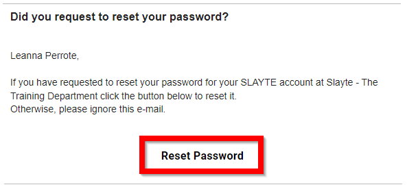
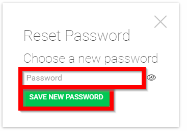
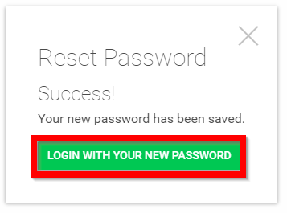

import { shareArticle } from '../../../components/share.js';
import { FaLink } from 'react-icons/fa';
import { ToastContainer, toast } from 'react-toastify';
import 'react-toastify/dist/ReactToastify.css';

export const ClickableTitle = ({ children }) => (
    <h1 style={{ display: 'flex', alignItems: 'center', cursor: 'pointer' }} onClick={() => shareArticle()}>
        {children} 
        <FaLink size="0.6em" />
    </h1>
);

<ToastContainer />

<ClickableTitle>Forgot Username/Password</ClickableTitle>

1. Enter your **email address** then select **NEXT**

2. Select **Forgot password?**

3. Select **SEND INSTRUCTIONS TO RESET PASSWORD**

****

4. You will soon receive instructions sent your your **email**

4. From your email select **Reset Password**

5. Type in **new password** then select **SAVE NEW PASSWORD**

****

6. Select **LOGIN WITH YOUR NEW PASSWORD**

****

7. [Log in](https://docs-for-customers.slayte.com/hc/en-us/articles/4412208074515)

