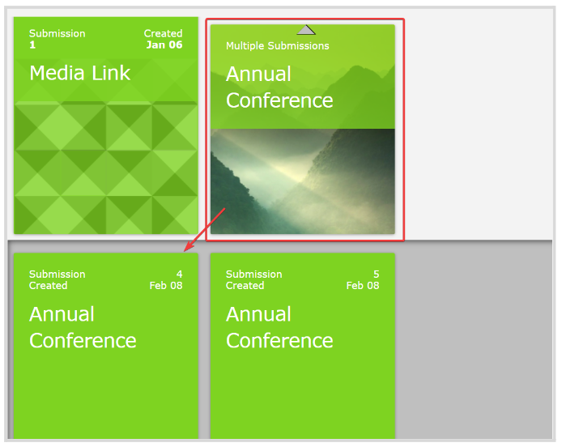
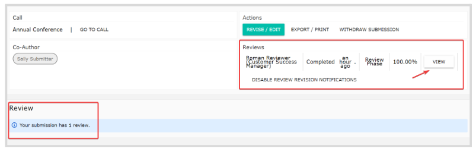
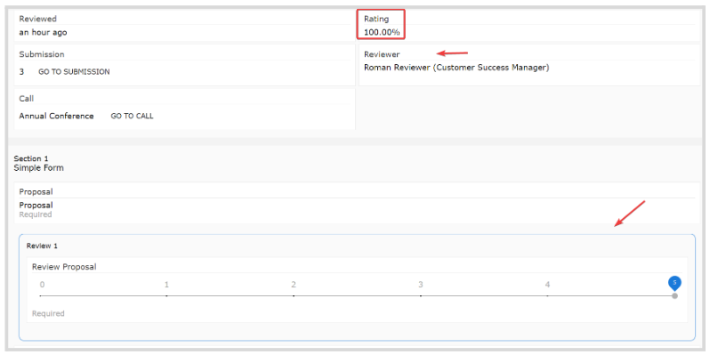

import { shareArticle } from '../../../components/share.js';
import { FaLink } from 'react-icons/fa';
import { ToastContainer, toast } from 'react-toastify';
import 'react-toastify/dist/ReactToastify.css';

export const ClickableTitle = ({ children }) => (
    <h1 style={{ display: 'flex', alignItems: 'center', cursor: 'pointer' }} onClick={() => shareArticle()}>
        {children} 
        <FaLink size="0.6em" />
    </h1>
);

<ToastContainer />

<ClickableTitle>How to access your Submission Review</ClickableTitle>

1. From the main menu, go to **Submissions**

2. Click the **Call** **tile** holding your submission. If you have multiple submissions for the same call, locate and click the specific **submission tile**

****

3. From the **submission page**, you can see the number of reviews your submission has under the Review section and the actual review in the Reviews section. Click **View** for details

4. From the **Review page**, you will be able to see your **Rating**, the **Reviewer's name,** and the **Review criteria** used

**/*/*/*Note:** Review data is only available if the function has been activated by the Administrator. 

