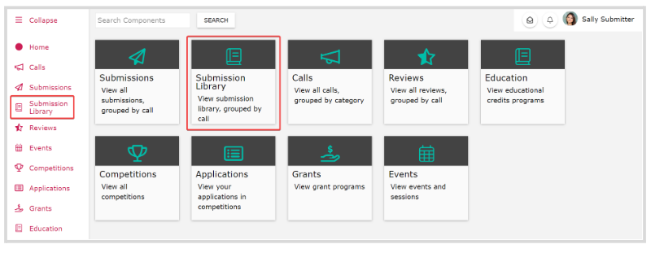
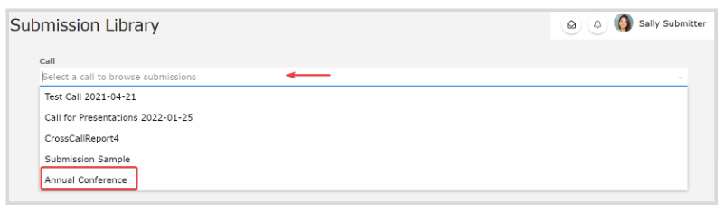
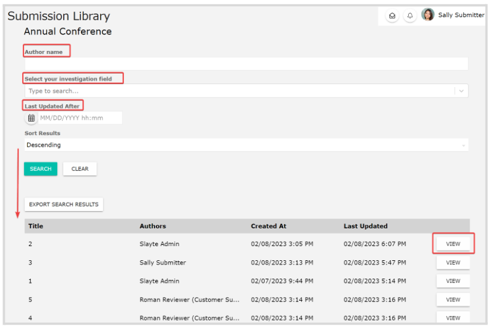
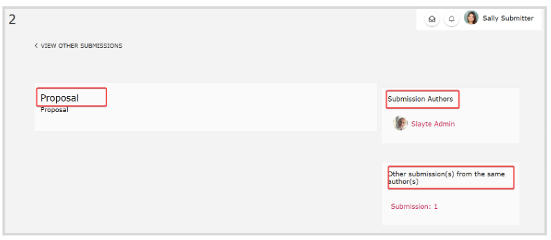
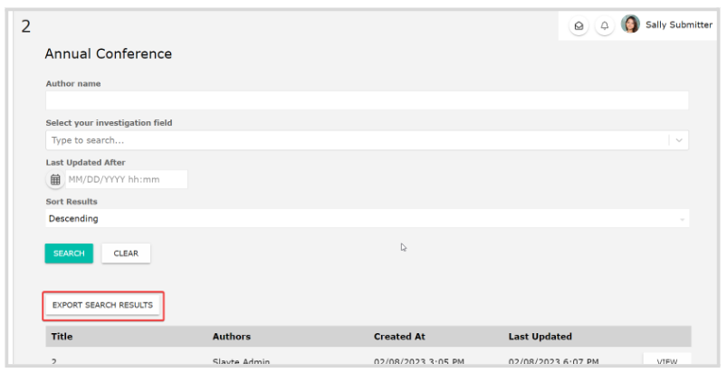
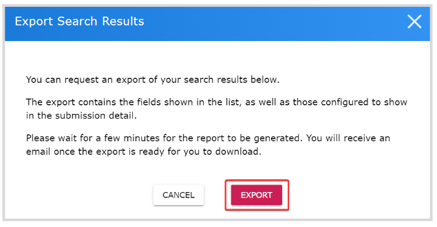
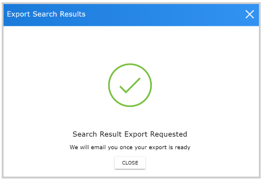

import { shareArticle } from '../../../components/share.js';
import { FaLink } from 'react-icons/fa';
import { ToastContainer, toast } from 'react-toastify';
import 'react-toastify/dist/ReactToastify.css';

export const ClickableTitle = ({ children }) => (
    <h1 style={{ display: 'flex', alignItems: 'center', cursor: 'pointer' }} onClick={() => shareArticle()}>
        {children} 
        <FaLink size="0.6em" />
    </h1>
);

<ToastContainer />

<ClickableTitle>How to use Submission Library</ClickableTitle>

From the Submission Library, you will be able to access certain submissions from selected Calls from anyone in your team/organization. Keep in mind, this feature will only be available if enabled by your Administrator.

1. Click **Submissions Library** from the Home page

2. Click the **Call** field, and select the **Call name** from the drop-down menu

3. The available submissions for that call will display at the bottom, however you can filter them to narrow the search with the available search criteria. Click View to access submission details.

4. From the submission page, you will have access to selected data from the Administrator. Such as submission-specific fields, submitter's information, and other submissions from the same submitter

## **Export Search Results**

1. After you have selected the call and filtered (if desired) the submissions, click **Export Search Results**

2. From the pop-up window, click **Export**

3. You will receive the following confirmation message, click **Close**

