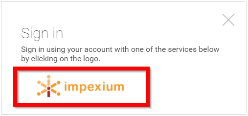
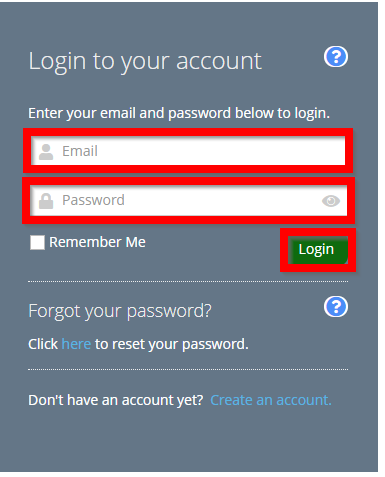

import { shareArticle } from '../../../components/share.js';
import { FaLink } from 'react-icons/fa';
import { ToastContainer, toast } from 'react-toastify';
import 'react-toastify/dist/ReactToastify.css';

export const ClickableTitle = ({ children }) => (
    <h1 style={{ display: 'flex', alignItems: 'center', cursor: 'pointer' }} onClick={() => shareArticle()}>
        {children} 
        <FaLink size="0.6em" />
    </h1>
);

<ToastContainer />

<ClickableTitle>Impexium Log In</ClickableTitle>

1. From the provided URL select **REGISTER/LOG IN** from the left corner of the page 

2. Click on the provided **logo**

**/*/*Please note, logos will vary.**

3. Enter in your **email address** and **password** that you use to sign in with Impexium then select **Login**

