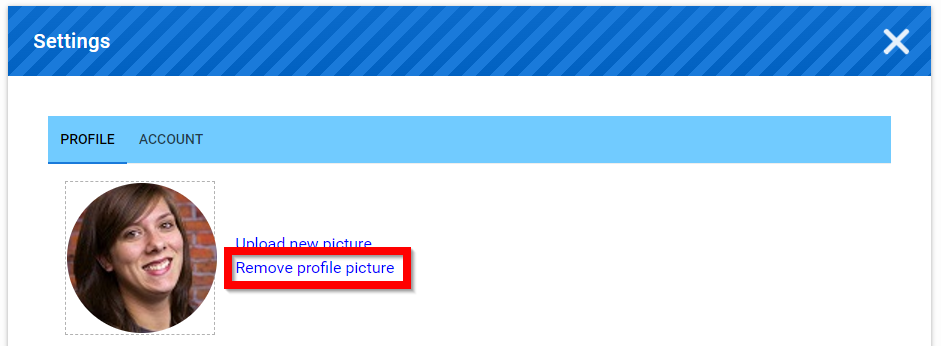

import { shareArticle } from '../../share.js';
import { FaLink } from 'react-icons/fa';
import { ToastContainer, toast } from 'react-toastify';
import 'react-toastify/dist/ReactToastify.css';

export const ClickableTitle = ({ children }) => (
    <h1 style={{ display: 'flex', alignItems: 'center', cursor: 'pointer' }} onClick={() => shareArticle()}>
        {children} 
        <FaLink size="0.6em" />
    </h1>
);

<ToastContainer />

<ClickableTitle>Remove Profile Picture</ClickableTitle>

1. Select **your name** in the upper right corner

### missing picture 1

2. Select **Settings**

### missing picture 2

3. Select **Remove profile picture**

4. You will be notified Successfully deleted profile image

5. Your picture will be removed

6. Select **SAVE** to complete change(s)

