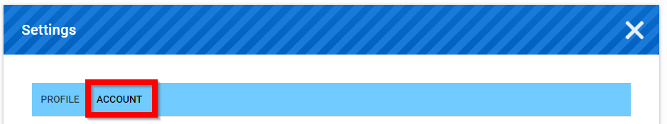
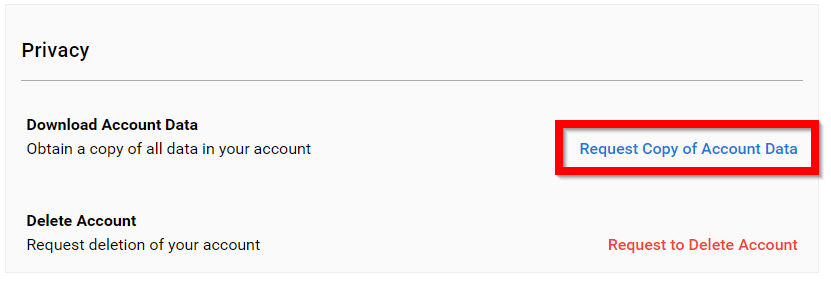
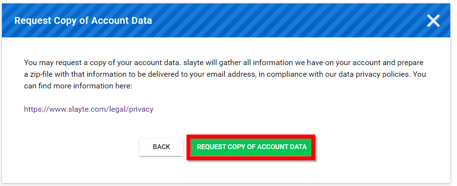
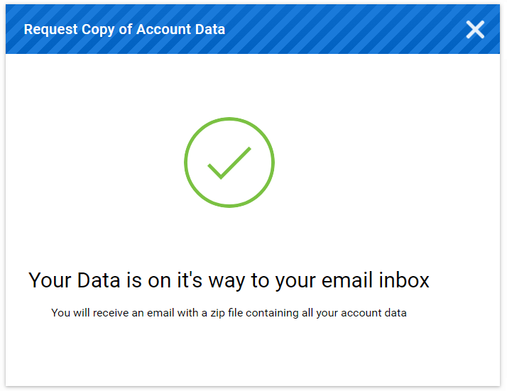
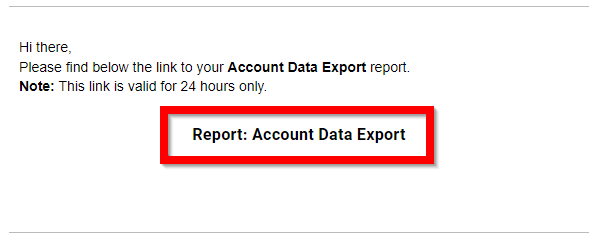

import { shareArticle } from '../../../components/share.js';
import { FaLink } from 'react-icons/fa';
import { ToastContainer, toast } from 'react-toastify';
import 'react-toastify/dist/ReactToastify.css';

export const ClickableTitle = ({ children }) => (
    <h1 style={{ display: 'flex', alignItems: 'center', cursor: 'pointer' }} onClick={() => shareArticle()}>
        {children} 
        <FaLink size="0.6em" />
    </h1>
);

<ToastContainer />

<ClickableTitle>Request Copy of Account Data</ClickableTitle>

1. Select **your name** in the upper right corner

2. Select **Settings**

3. Select **ACCOUNT**

****

4. Select **Request Copy of Account Data**

****

5. Select **Request Copy of Account Data**

****

6. You will receive an email with a zip file congaing all your account data **navigate to your email**

7. Select **Report: Account Data Export** from your email

8. Download the **zip file**

 

