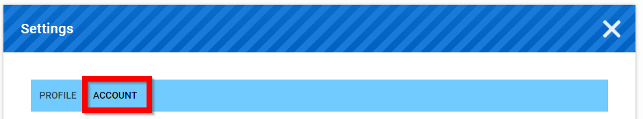
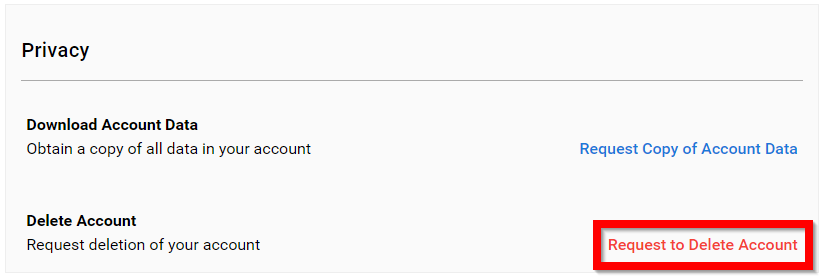
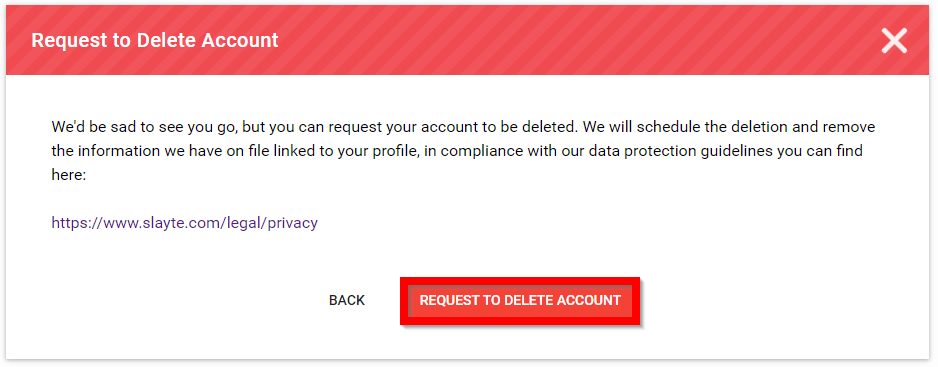
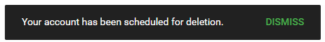

import React from 'react';
import { shareArticle } from '../../share.js';
import { FaLink } from 'react-icons/fa';
import { ToastContainer, toast } from 'react-toastify';
import 'react-toastify/dist/ReactToastify.css';

export const ClickableTitle = ({ children }) => (
    <h1 style={{ display: 'flex', alignItems: 'center', cursor: 'pointer' }} onClick={() => shareArticle()}>
        {children} 
        <FaLink size="0.6em" />
    </h1>
);

<ToastContainer />

<ClickableTitle>Request to Delete Account</ClickableTitle>

1. Select **your name** in the upper right corner

2. Select **Settings**

3. Select **ACCOUNT**

****

4. Select **Request to Delete Account**

****

5. Select **Request to Delete Account**

****

6. You will be notified Your account has been scheduled for deletion

7. Select [Logout](https://docs-for-customers.slayte.com/hc/en-us/articles/4412308411027) 

 

