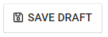
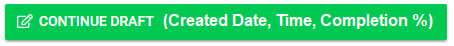

import React from 'react';
import { shareArticle } from '../../share.js';
import { FaLink } from 'react-icons/fa';
import { ToastContainer, toast } from 'react-toastify';
import 'react-toastify/dist/ReactToastify.css';

export const ClickableTitle = ({ children }) => (
    <h1 style={{ display: 'flex', alignItems: 'center', cursor: 'pointer' }} onClick={() => shareArticle()}>
        {children} 
        <FaLink size="0.6em" />
    </h1>
);

<ToastContainer />

<ClickableTitle>Save a Submission Draft</ClickableTitle>

You can save your Submission at any point manually by clicking **Save Draft** on the top right. This allows you to leave your Submission and return to it at a later date, picking up from where you left off.

To return to your saved draft, simply navigate to the desired call then select **Continue Draft**.

