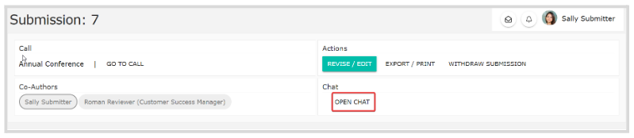
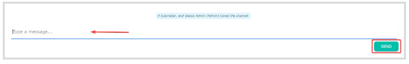
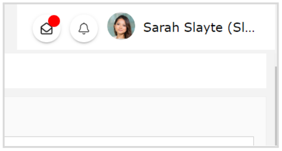
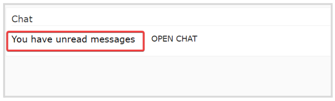

import { shareArticle } from '../../../components/share.js';
import { FaLink } from 'react-icons/fa';
import { ToastContainer, toast } from 'react-toastify';
import 'react-toastify/dist/ReactToastify.css';

export const ClickableTitle = ({ children }) => (
    <h1 style={{ display: 'flex', alignItems: 'center', cursor: 'pointer' }} onClick={() => shareArticle()}>
        {children} 
        <FaLink size="0.6em" />
    </h1>
);

<ToastContainer />

<ClickableTitle>Start a Chat on a Submission</ClickableTitle>

When enabled by the Administrator, you can initiate a Chat per submission basis with the Administrator and Reviewer to discuss details of the submission or review, comments, etc. To start a **Chat**, follow these steps:

1. Go to **Submissions**, and click the desired **submission tile**  
2. From the **Chat section**, click **Open Chat**

   
3. Type your message and click **Send**

  
4. If you are no longer in the chat window, for new messages; you will receive a red alert on the envelope icon on the right top corner of your profile section

Or when accessing the submission, in the Chat section you'll see **You have unread messages**

****

