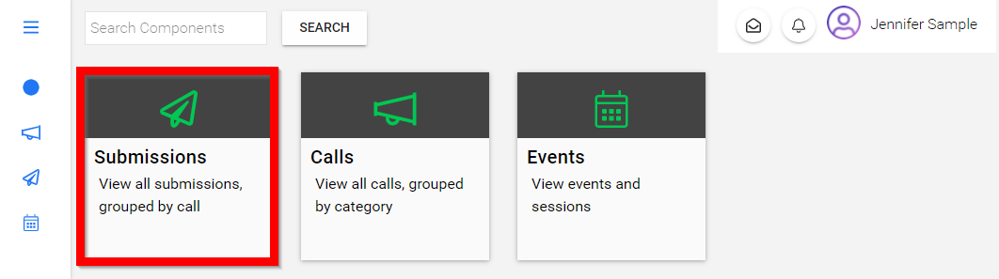

import { shareArticle } from '../../../components/share.js';
import { FaLink } from 'react-icons/fa';
import { ToastContainer, toast } from 'react-toastify';
import 'react-toastify/dist/ReactToastify.css';

export const ClickableTitle = ({ children }) => (
    <h1 style={{ display: 'flex', alignItems: 'center', cursor: 'pointer' }} onClick={() => shareArticle()}>
        {children} 
        <FaLink size="0.6em" />
    </h1>
);

<ToastContainer />

<ClickableTitle>Submit to Additional Phase(s)</ClickableTitle>

Congratulations your submission was ***accepted*** and now you have been asked to continue to the next phase!

1. From the home screen navigate to the **Submissions** tab

2. Select the **tile** of where you submitted for the first phase

 

3. You will be redirected to view *your submission* then select **GO TO CALL**

4. You will be redirected to the call to select **CREATE NEW SUBMISSION**

5. **Fill in** the form fields

6. Once you have filled in all required/* fields select **FINISH**

7. **Review** your submission 

8. ***OPTIONAL*** To modify your submission prior to submitting select the **pencil** then make necessary changes

9. Select **FINISH**

10. Select **SUBMIT** when ready

