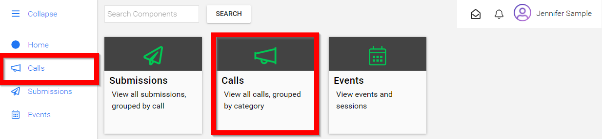
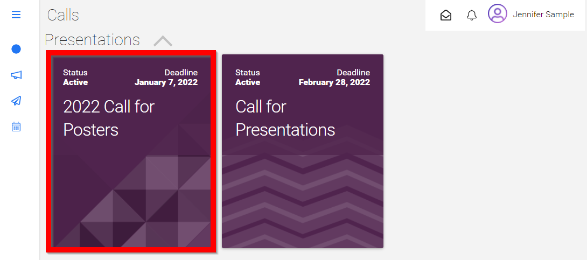
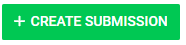
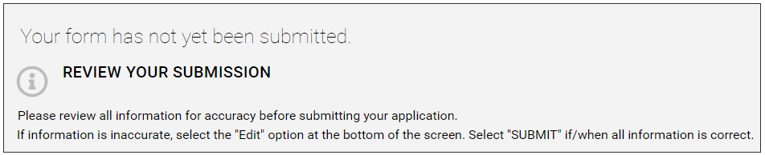
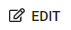
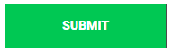

import { shareArticle } from '../../../components/share.js';
import { FaLink } from 'react-icons/fa';
import { ToastContainer, toast } from 'react-toastify';
import 'react-toastify/dist/ReactToastify.css';

export const ClickableTitle = ({ children }) => (
    <h1 style={{ display: 'flex', alignItems: 'center', cursor: 'pointer' }} onClick={() => shareArticle()}>
        {children} 
        <FaLink size="0.6em" />
    </h1>
);

<ToastContainer />

<ClickableTitle>Submit to a Call</ClickableTitle>

1. From the Home screen/Dashboard select **Calls** either from the left menu or the call tile

2. You will be redirected to the **Calls** page

3. Select the desired call by **clicking on the call tile**

****

4. Carefully read information provided by your Call Administrator then proceed to select **CREATE SUBMISSION**

5. Fill in the form fields

6. Once you have filled in all required/* fields select **FINISH**

7. **Review** your submission 

8. To modify your submission prior to submitting select the **pencil** then make necessary changes

9. Select **FINISH**

10. Select **SUBMIT** when ready

