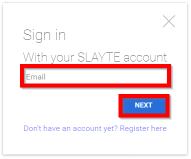
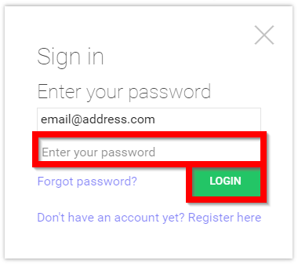

import { shareArticle } from '../../../components/share.js';
import { FaLink } from 'react-icons/fa';
import { ToastContainer, toast } from 'react-toastify';
import 'react-toastify/dist/ReactToastify.css';

export const ClickableTitle = ({ children }) => (
    <h1 style={{ display: 'flex', alignItems: 'center', cursor: 'pointer' }} onClick={() => shareArticle()}>
        {children} 
        <FaLink size="0.6em" />
    </h1>
);

<ToastContainer />

<ClickableTitle>Traditional Log In</ClickableTitle>

This article covers the following Topics:

* [Traditional Login](https://docs-for-customers.slayte.com/hc/en-us/articles/4412208074515-Traditional-Log-In#h_01G7SQMZG0YAA2PK7Z4GG6W635)

### Traditional Login

1. From the provided URL select **REGISTER/LOG IN** from the left corner of the page

2. Type in your **email address** then select **NEXT**

****

3. Type in your **password** then select **LOGIN**

4. You will be redirected to the **Home screen**

