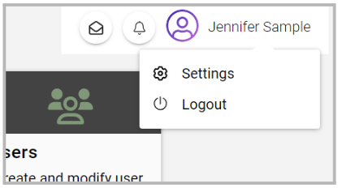
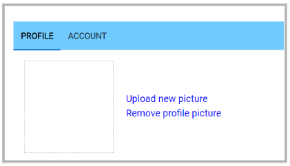
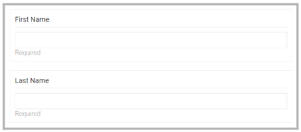
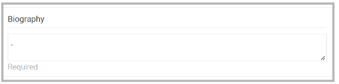

import React from 'react';
import { shareArticle } from '../../share.js';
import { FaLink } from 'react-icons/fa';
import { ToastContainer, toast } from 'react-toastify';
import 'react-toastify/dist/ReactToastify.css';

export const ClickableTitle = ({ children }) => (
    <h1 style={{ display: 'flex', alignItems: 'center', cursor: 'pointer' }} onClick={() => shareArticle()}>
        {children} 
        <FaLink size="0.6em" />
    </h1>
);

<ToastContainer />

<ClickableTitle>Update Your Profile</ClickableTitle>

Within the Slayte console, you are able to update the personal information listed in your profile. This article will give you the steps to follow to update:

1. [Profile picture](https://docs-for-customers.slayte.com/hc/en-us/articles/7725594404371-Update-Your-Profile-#h_01G7SS38TC1HAV5MYDHCWZ2MJX)
2. [First and last name](https://docs-for-customers.slayte.com/hc/en-us/articles/7725594404371-Update-Your-Profile-#h_01G7SVYQFZR0P4RYGQYDPFNM71)
3. [Biography](https://docs-for-customers.slayte.com/hc/en-us/articles/7725594404371-Update-Your-Profile-#h_01G7SW562P9RSG1A0RVH8SXHKC)

To proceed, first sign in at Slayte. On the right top corner, click the profile icon and select “settings”: 

## Profile picture

From the pop-up window, the first option is to add/update a picture. 

If you are looking to add/ update a picture, click "Upload new picture". You will be able to select locally the image you would like to use. 

## First and Last name

From the pop-up window, scroll to the First and Last name fields to update as needed. 

## Biography

In this section, you can include a detailed description of yourself. Keep in mind, that this biography will be the one visible online or in any papers/ submissions. Please note, that if you do not have a Biography section this may not be set up by your system administrator. 

Once any of the above changes have been completed, click Save at the bottom of the pop-up window. A confirmation pop-up message will appear to confirm the change has been successful.

Note, when it comes to updating your Email Address; you are required to complete the change via Impexium instead. Once updated in Impexium, it will automatically be updated in Slayte. 

