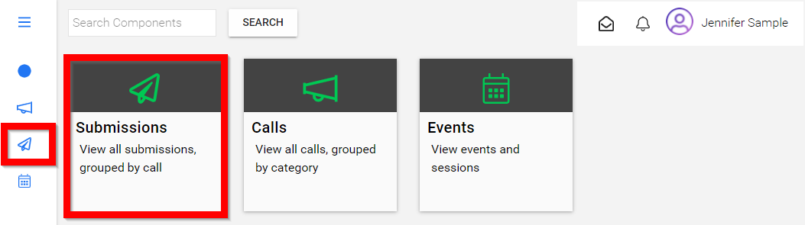
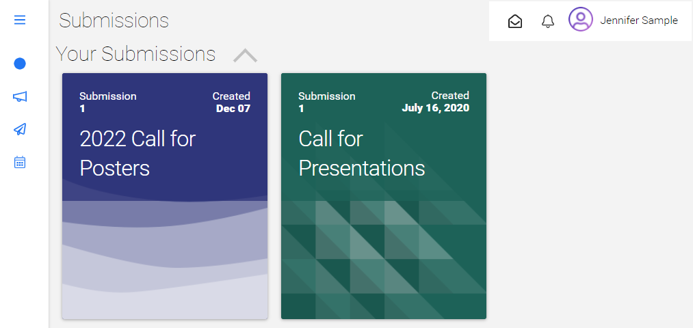

import React from 'react';
import { shareArticle } from '../../share.js';
import { FaLink } from 'react-icons/fa';
import { ToastContainer, toast } from 'react-toastify';
import 'react-toastify/dist/ReactToastify.css';

export const ClickableTitle = ({ children }) => (
    <h1 style={{ display: 'flex', alignItems: 'center', cursor: 'pointer' }} onClick={() => shareArticle()}>
        {children} 
        <FaLink size="0.6em" />
    </h1>
);

<ToastContainer />

<ClickableTitle>View Submission(s)</ClickableTitle>

Once you have successfully created a submission, this will be automatically added to your profile and accessible from the Submissions menu or directly from the Call. 

## **Immediately after Submitting**

1.  Select **VIEW SUBMISSION**

## **From Submissions**

1. From the Home Screen, select the **Submission icon** from the left menu or the **Submission tile**

2. You will be redirected to the **Submissions page** to view your submissions

3. Select the **desired submission** to open

## **From the Call**

1. From the Home Screen, select the **Calls icon** from the left menu or the **Calls tile**

****

2. Click the **Call tile** holding your submission

3. From the main Call page, scroll down to **Your Submissions** section, where you can click any of the submissions links to access the details of the submission

