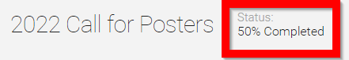

import React from 'react';
import { shareArticle } from '../../share.js';
import { FaLink } from 'react-icons/fa';
import { ToastContainer, toast } from 'react-toastify';
import 'react-toastify/dist/ReactToastify.css';

export const ClickableTitle = ({ children }) => (
    <h1 style={{ display: 'flex', alignItems: 'center', cursor: 'pointer' }} onClick={() => shareArticle()}>
        {children} 
        <FaLink size="0.6em" />
    </h1>
);

<ToastContainer />

<ClickableTitle>View Submission Progress</ClickableTitle>

The Status Bar displayed at the top of the page shows how much progress has been made on your Submission Form, based on the amount of required Fields completed. This is particularly useful when the Submission Form spans several pages. Once you’ve reached 100% you are able to submit.

 

 

**/* Please Note:** Optional Fields do not contribute to the progress indication.

