import React from 'react';
import { shareArticle } from '../../share.js';
import { FaLink } from 'react-icons/fa';
import { ToastContainer, toast } from 'react-toastify';
import 'react-toastify/dist/ReactToastify.css';

export const ClickableTitle = ({ children }) => (
    <h1 style={{ display: 'flex', alignItems: 'center', cursor: 'pointer' }} onClick={() => shareArticle()}>
        {children} 
        <FaLink size="0.6em" />
    </h1>
);

<ToastContainer />

<ClickableTitle>Vote for a Submission</ClickableTitle>

1. From the main menu, go to **Calls**

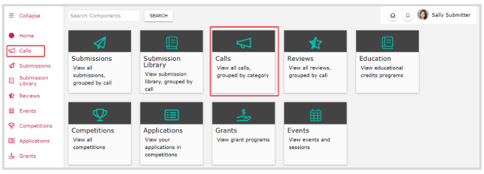   
2. Locate the Call holding the submission to vote for, and click the **Call tile**

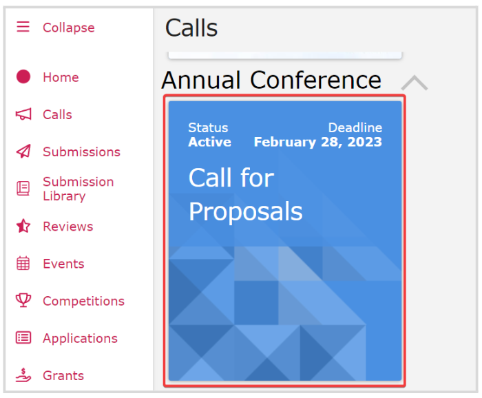  
3. Scroll down to the **Vote** section, and click **Vote**

**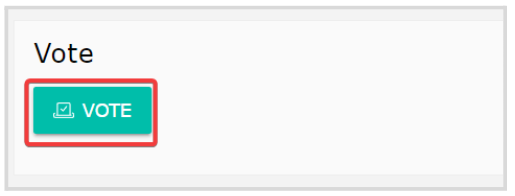**

4. You will be presented with the available submissions to vote for, click the **submission tile** you prefer

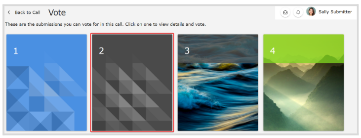

5. From the submission voting page, click **Vote** 

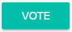

6. From the pop-up window, submit your vote and click **Confirm Vote**

**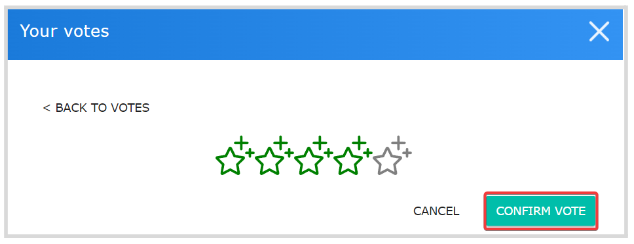**

7. You will receive the following confirmation

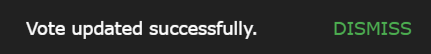

8. You will also see a preview of your vote, where you can **Edit** if needed

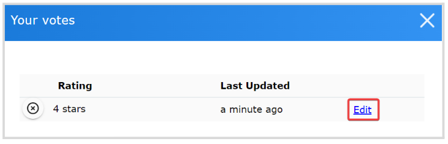

In the case, multiple votes are allowed for the same submission, click **Vote** again 

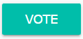

Then from the pop-up window, click **+ Cast Another Vote**

**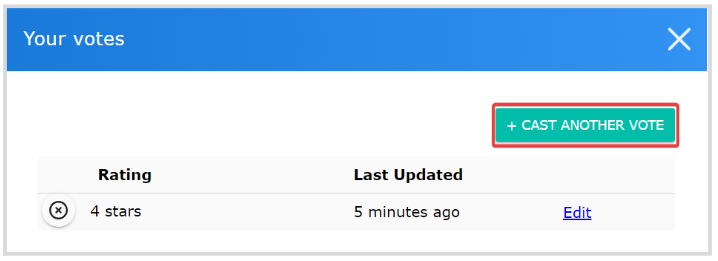**

## **Delete a Vote**

If you change your mind or would like to vote at another time, you can delete/remove your vote. 

1. From the **Call** main page, go to the Vote section and click **Vote**  
2. Click the submission tile holding your vote   
3. Click **Vote**

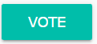   
4. From **Your Votes** window, click the **X** icon to the left of your vote

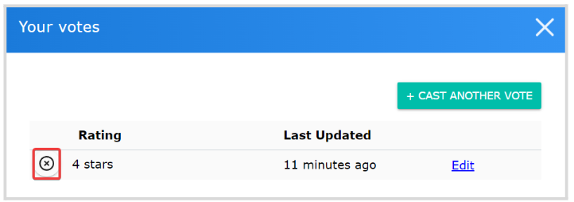  
5. Click **Yes** to continue

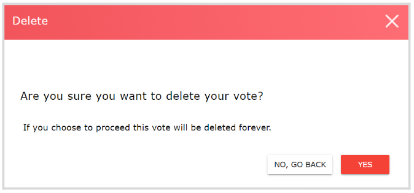  
6. You will receive the following confirmation message 

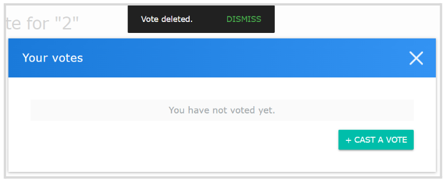

