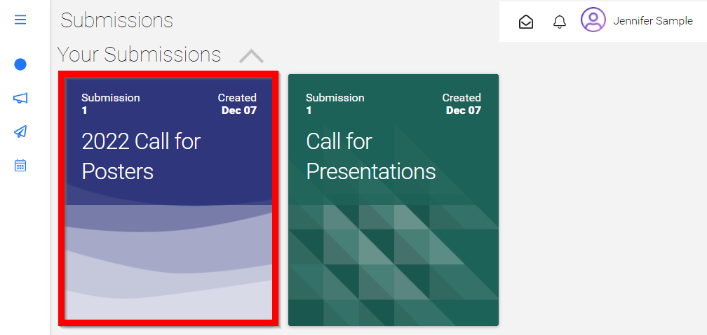

import { shareArticle } from '../../../components/share.js';
import { FaLink } from 'react-icons/fa';
import { ToastContainer, toast } from 'react-toastify';
import 'react-toastify/dist/ReactToastify.css';

export const ClickableTitle = ({ children }) => (
    <h1 style={{ display: 'flex', alignItems: 'center', cursor: 'pointer' }} onClick={() => shareArticle()}>
        {children} 
        <FaLink size="0.6em" />
    </h1>
);

<ToastContainer />

<ClickableTitle>Withdraw a Submission</ClickableTitle>

1. From the Home Screen, select the **Submission icon** from the left menu or **Submission tile**

2. You will be redirected to the **Submissions page** to view your submissions

3. Select the **desired submission** to open

4. From the **Actions** section, click **Withdraw Submission**

5. Select **YES** to proceed 

/*/*Please note, you will receive an email that you have withdrawn your submission.

