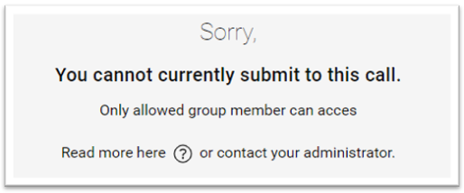

import { shareArticle } from '../../../components/share.js';
import { FaLink } from 'react-icons/fa';
import { ToastContainer, toast } from 'react-toastify';
import 'react-toastify/dist/ReactToastify.css';

export const ClickableTitle = ({ children }) => (
    <h1 style={{ display: 'flex', alignItems: 'center', cursor: 'pointer' }} onClick={() => shareArticle()}>
        {children} 
        <FaLink size="0.6em" />
    </h1>
);

<ToastContainer />

<ClickableTitle>Submission Access Restricted</ClickableTitle>

Some calls are only accessible for certain users or groups of users, and this entirely depends on the configuration set up by the administration when they created the call that you're submitting to.

If you're wondering why no access is granted to you, it is best to get in touch with the individual who set up the call via your administrator.

 

